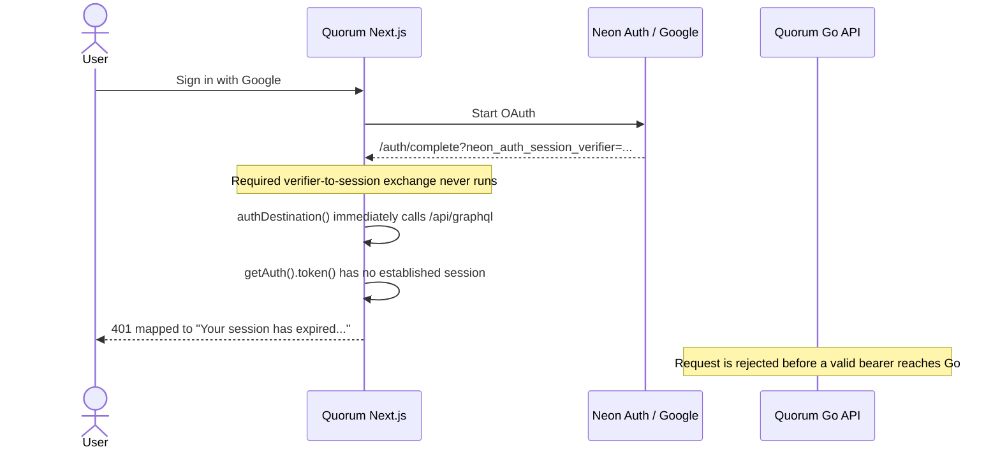
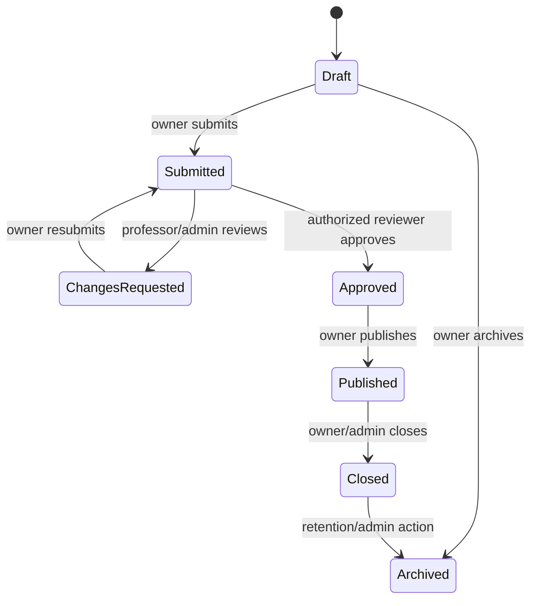
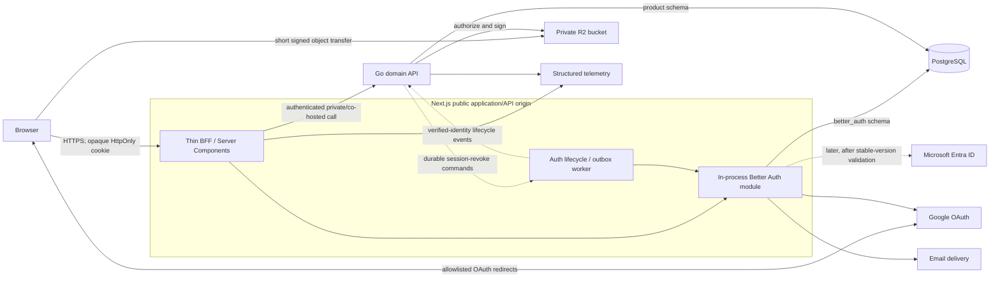
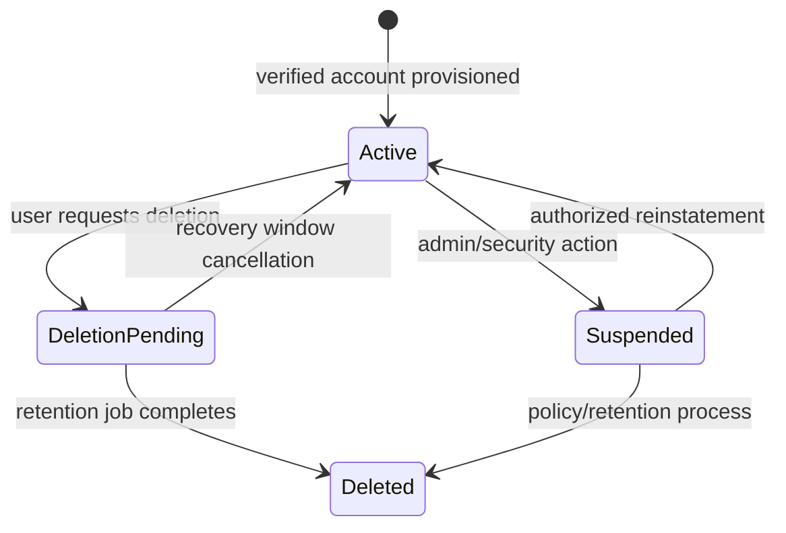

# Quorum Authentication Architecture and Security Audit

**Audit date:** 2026-07-24  
**Repository:** Quorum (`apps/web` Next.js, `apps/api` Go/gqlgen, PostgreSQL, Cloudflare R2)  
**Purpose:** outsider audit, target design, implementation method, security checklist, and mentoring reference

> **Implementation source of truth:** this is a point-in-time audit and rationale document. Contributors implementing auth v2 must follow `AGENTS.md` and the smaller normative living documents under `docs/auth/`, beginning with `docs/auth/STATUS.md`. Accepted living decisions and invariants supersede provisional questions or historical implementation details in this audit.
>
> This is a static code and architecture audit, not a penetration test or a compliance certification. It identifies code-proven defects and design risks, but deployed DNS, reverse proxies, cookies, provider settings, bucket ACLs, production environment variables, and runtime behavior still require verification. “OWASP-safe” is not a binary state; the practical goal is evidence that agreed security requirements are designed, tested, operated, and independently reviewed.

## 1. Executive decision

Quorum does not need a whole-application rewrite, and it should not continue accumulating patches around the current auth seams. It needs a **targeted rewrite of the authentication boundary and a systematic repair of authorization policy**.

The provisionally preferred POC architecture, subject to the acceptance spike below, is:

1. Replace `@neondatabase/auth` with an exact, security-reviewed stable release of **Better Auth used directly** in Next.js, if the spike proves the required session boundary.
2. Store opaque, revocable sessions in PostgreSQL; give the browser only a `Secure`, `HttpOnly`, host-only cookie.
3. Make Next.js the only **browser-facing Quorum product origin** and the backend-for-frontend (BFF). OAuth redirects and narrowly signed object transfers still go to allowlisted third parties. Go should be private/co-hosted; if hosting forces non-browser public ingress, protect it with explicit service authentication and do not call it “private.”
4. **Retain Go as a dedicated domain backend through the auth/security rewrite**, with a thin Next.js BFF in front. This is justified by migration risk, existing workflow/SQL/test investment, and the need for one policy owner—the repository contains about 7,800 handwritten Go/SQL/test lines excluding generated output, a 427-physical-line (398 nonblank) graph schema, 39 mutations, and multiple state machines. Long-term retention requires named Go expertise and operational ownership; it is not justified by 500–800-user scale or résumé value alone.
5. Keep product roles, resource ownership, lifecycle transitions, and authorization in Go/PostgreSQL. Keep the browser session and web composition in Next. Do not use editable profile fields or identity-provider metadata as authorization.
6. Create separate public, self, and admin API shapes. Make resumes and other private files private objects delivered by short-lived authorized download URLs.
7. Build the replacement in test-first vertical slices after writing the threat model, policy matrix, and session/account contracts.

For infrastructure, **managed Supabase PostgreSQL is a reasonable POC candidate, but “use Supabase” is not one indivisible decision**. Database, Auth, Storage, browser Data APIs, and Realtime are separate choices. The accepted starting evaluation is Supabase PostgreSQL with server-only access and existing private R2; changing storage remains a later adapter/operations ADR. Do not enable Supabase Auth and Better Auth together. Supabase Auth remains an alternative candidate, not the default, because its documented SSR design intentionally makes access and refresh tokens available to browser code; that conflicts with Quorum's chosen opaque-`HttpOnly`-credential invariant.

After reviewing the repository's existing Go migrator and the services Quorum actually intends to use, the local-development decision is narrower: run a pinned vanilla PostgreSQL container plus Mailpit, not the complete Supabase CLI stack. Keep `apps/api/migrations` as the single migration authority. This remains portable to managed Supabase PostgreSQL because the application uses ordinary PostgreSQL connections and SQL; the portable artifact is the schema plus application containers, not `supabase start`.

The owner initially reported no real users, but the 2026-07-24 read-only A00 inventory disproved database emptiness: the configured Neon database contains 40 product users, 30 auth users, 31 auth accounts, 48 sessions, and 461 aggregate rows. Thirty-seven product profiles use the test `example.com` domain; three do not, and ownership was intentionally not inspected through PII. Treat this as nonempty legacy POC data of unresolved ownership. A clean replacement may still be appropriate, but only after a protected backup, restore evidence, and explicit disposition; existing sessions will be invalidated at cutover.

### Why Better Auth is the POC recommendation

It fits the clarified constraints better than Neon Auth or a hosted-only identity vendor:

- MIT-licensed and self-hostable.
- Database-backed sessions with listing and revocation.
- Email/password and Google now, with an architecture that can add Microsoft/Entra later. The exact stable release's first-class or generic OAuth/OIDC support must be proven; do not depend on a beta provider implementation.
- Native Next.js integration, email verification/reset hooks, rate limiting, and test utilities.
- It removes the current beta Neon wrapper while retaining the underlying approach.

This recommendation is not “authentication is free.” Production email delivery, monitoring, backups, dependency upgrades, abuse controls, key rotation, and incident response still have an operational cost. If those responsibilities become undesirable, the same application boundary can later move to a managed OIDC provider.

Before committing, run a time-boxed acceptance spike against one exact stable release and record that version in the ADR. Prove Next compatibility, migrations into a dedicated unexposed PostgreSQL schema (not Supabase's reserved `auth` schema), Google callback protections, email hooks, multi-instance rate limiting, revocation, absolute/idle enforcement, and explicit-linking behavior. Prove that every mounted `/api/auth/*` route can be allowlisted or filtered so browser responses omit reusable credentials. Better Auth's documented session schema stores the cookie token in a `token` column and its default session response includes session fields, so database access and response projection deserve explicit review. If a non-negotiable invariant cannot be met without fragile framework patching, use a standalone self-hosted IdP or a managed OIDC provider instead.

### What not to build

- Do not design a password hashing scheme, OAuth implementation, session token format, or recovery protocol from scratch.
- Do not put roles in browser state or trust role/email/profile flags sent by a client.
- Do not expose the Go API merely because it exists.
- Do not use a provider ID token as a general API access token.
- Do not treat a successful login screen as proof that authorization or session lifecycle is correct.

## 2. Direct answers to the engineering questions

### Patch, refactor, or rewrite?

**Rewrite the auth boundary; retain the product domain.** The Next-to-auth-provider callback/session code, identity mapping, server principal construction, and auth observability should be replaced as a coherent unit. The database-backed business model can remain, but its authorization gates need an explicit policy pass because several current resolvers disclose or mutate data without the required relationship checks.

### TDD, bottom-up, or build then resolve?

None of those slogans is sufficient alone. Use this order:

1. Define actors, assets, trust boundaries, state machines, and security invariants.
2. Turn those decisions into executable acceptance and authorization-matrix tests.
3. Build one complete vertical slice: login -> callback -> session -> viewer -> authenticated domain query -> logout. If Go is retained, this slice includes the authenticated Next-to-Go hop.
4. Add one capability at a time, with its failure and abuse cases tested first.
5. Run real-browser and real-provider smoke tests in addition to deterministic CI tests.

This is **outside-in, contract-first, test-first development**. Tests do not invent the architecture, and the implementation is not allowed to invent policy that was never agreed.

### Is Go better than pure Next.js here?

Not for runtime scale. Either stack can handle 500–800 users by a huge margin. After inspecting the backend, **Quorum should preserve the existing Go service through the security rewrite rather than combine auth replacement with a domain-language migration**:

- about 7,800 handwritten Go/SQL/test lines excluding generated gqlgen/sqlc output;
- a 427-physical-line (398 nonblank) GraphQL schema with 17 queries and 39 mutations;
- team membership, join-request, invitation, project approval, application/offer/confirmation, account, file, notification, and audit workflows;
- transaction, concurrency, authorization, and lifecycle invariants that should have one non-UI owner.

That is no longer “a separate backend for a few CRUD calls.” Rewriting it into Next would trade one operational boundary for a broad language/domain migration during a security rewrite. Domain size alone does not prove that a separate process is more maintainable: retention is conditional on the team having Go expertise, a named long-term owner, and willingness to operate the boundary. The costs remain real—two runtimes, service identity, tracing, a network hop, deployment coordination, and two patch streams—but preserving current behavior and one product-policy owner is the lower-risk decision now.

| Goal | Better choice |
|---|---|
| Quorum now: secure/rebuild auth without needless product rewrite | **Thin Next.js BFF + private Go domain API** |
| Greenfield product with one small web client and little domain logic | Modular Next.js + PostgreSQL |
| Java-first team/institution with Spring operational expertise | Next.js BFF + Spring Boot can be valid |
| Scale to 800 users | Either; this is not a deciding factor |

Next server code is still a real backend: Server Components, Route Handlers, Server Actions, and modules marked `server-only` are not shipped in the browser bundle. The recommendation to retain Go is therefore about Quorum's existing domain size, ownership, readability, and change isolation—not a claim that Next server code is “frontend” or insecure.

If a future ADR chooses consolidation, use a strangler migration after auth stabilizes: lock Go behavior with workflow/authorization tests, move one use case at a time behind the same contract, keep exactly one writer/source of truth per aggregate, compare behavior/performance, and retire Go only after parity, security, and load gates pass.

### Do we still need a private API layer?

**A trusted authorization boundary is mandatory. Quorum's chosen implementation is the existing dedicated Go service behind Next; a separate network process is not a universal security requirement.**

Use these terms precisely:

- **Client/frontend code** is JavaScript delivered to the browser. It must contain no secrets and supplies no authority.
- **Public application interface** is any route the browser can reach. Even if named `/internal`, it is public from a threat-model perspective and must authenticate, authorize, validate, limit, and project its output.
- **Private server layer** is code that the browser cannot import or execute: use cases, policies, repositories, secrets, provider adapters, and database access. In Next.js it can live under `server-only` modules and be called directly by Server Components or thin Route Handlers.
- **Private network service** is an additional deployment boundary such as Go. It may improve language/process isolation and domain/team ownership, but it adds service authentication, latency, failure modes, tracing, deployment, and key/certificate operations. It is not automatically safer.

The Quorum rule is: client components render and submit intent; a thin Next BFF terminates the browser session and turns intent into a typed internal command/query; Go resolves the principal, applies policy/state transitions, and calls repositories; PostgreSQL enforces constraints. Never import repositories, admin SDKs, environment secrets, or authorization decisions into client components. Never duplicate product authorization in Next.

Direct browser access through a Supabase publishable key plus correct RLS can be secure, but it creates a different architecture in which the database/Data API is intentionally a public application interface and RLS becomes a primary policy engine. Quorum has workflow-heavy, multi-role rules and one web client, so this audit recommends keeping browser data access behind the Next BFF and treating database RLS as defense in depth, not the only business-policy implementation.

### Maintainability: Go, Spring Boot, Express, or Next?

All four can serve 800 users. Framework throughput is the wrong selector; choose where rules live, how strongly structure is enforced, how much existing code is discarded, and who will operate it.

| Choice | Strength for Quorum | Main cost | Decision |
|---|---|---|---|
| Existing Go service | Explicit types, simple deployment artifact, current domain/tests/SQL already exist, good fit for transaction-heavy use cases | Must refactor resolver-heavy code and operate the Next-to-Go identity/network boundary | **Keep** |
| Spring Boot | Excellent conventions/ecosystem for security, transactions, validation, DI, metrics, health, and larger teams | Full backend rewrite, Java/tooling/operational overhead, no product capability gained solely by switching | Do not migrate unless Java/Spring is an explicit institutional/team requirement |
| Raw Express | Technically capable and lightweight | Express deliberately supplies neither application structure nor authentication policy; Quorum would have to design/enforce every convention and still operate a second service | Do not rewrite Go into Express |
| All domain logic in Next | One language/deployment and fastest in-process composition; disciplined server-only modules can hold serious domain logic | Broad migration now, plus accidental UI/domain coupling unless module/dependency rules are enforced | Valid greenfield option; not the best current migration |

If starting a new dedicated TypeScript backend, use an opinionated module/validation/testing architecture rather than assuming Express routes create architecture. That still would not justify discarding working Go here. Spring is a defensible greenfield or Java-team choice, but a larger framework does not automatically produce clearer policy; annotations can hide control flow just as resolvers can.

Refactor Go toward thin transports and readable domain modules:

```text
internal/domain/identity, team, project, application
internal/app/commands and queries
internal/policy
internal/adapters/postgres, files, email
internal/transport/graphql (or HTTP)
```

GraphQL resolvers should validate/translate and call one use case; they should not hydrate graphs, decide policy, and orchestrate transactions themselves. Packages depend inward, domain types do not import gqlgen/database types, and each state transition has focused unit plus PostgreSQL integration tests. This is what makes a dedicated backend maintainable—not the `.go` extension.

### A Next BFF versus a separate Express backend

**BFF is an architectural role; Express is a web framework.** They are not opposites. A BFF can be implemented in Next, Express, Go, or Spring.

The recommended flow is:

```text
Browser
  -> Next BFF (same-origin cookie, CSRF/origin checks, UI-shaped request/response)
    -> private Go domain API (principal, policy, workflows, transactions)
      -> PostgreSQL
```

The Next BFF exists specifically for this web UI. It owns the browser session boundary, server rendering, view composition, response sanitization, and translation to a small set of internal operations. It should be thin. Next Route Handlers and Server Actions are still publicly reachable requests and must be protected; “inside the Next repository” does not make an endpoint private.

A separate Express service could play one of three roles:

1. **Browser calls Express directly:** Express is a public product API. Quorum now manages another origin or public hostname, CORS/cross-site cookie or bearer-token policy, and a broader client contract. Those calls bypass the Next BFF's session, projection, and policy controls.
2. **Next calls Express privately:** Express is the domain backend—the role Go already fills. Replacing Go with Express changes language/framework but removes no service or security complexity.
3. **Express only proxies to Go:** it duplicates the BFF/gateway already available in Next and adds a hop with little value.

Therefore no extra Express service is recommended. The useful separation is **Next BFF versus Go domain backend**, with a generated/typed internal contract and one policy owner—not “frontend versus real backend.”

### Should PostgreSQL mean Supabase?

Supabase is **PostgreSQL plus an optional platform**, not a different kind of database. Decide its pieces independently:

| Supabase piece | Quorum recommendation | Reason |
|---|---|---|
| Managed PostgreSQL | Good POC candidate | Standard Postgres, poolers, dashboard, easy start; keep migrations/provider-neutral |
| Auth | Alternative to Better Auth, not an add-on | Supports password, Google, and Azure/Microsoft, but standard SSR stores access and refresh tokens in cookies readable by browser code; do not run two auth authorities |
| Storage | Viable, but compare with existing R2 | Private buckets/RLS are useful; current free storage is smaller than R2's free allowance and signed URLs still have residual validity |
| Browser Data API / `supabase-js` | Do not use for product data initially | It would split policy between RLS and the application and widen the public surface without a current client need |
| Realtime / Edge Functions / GraphQL API | Leave off until a use case exists | Avoid paying an operational and conceptual cost for unused components |

For a free POC, managed Supabase is attractive, but its current Free plan is a development/demo tier: 500 MB database, 1 GB file storage, no automatic backups, and pausing after a week of low activity. At 800 users, 1 GB is only about 1.25 MB per registered user before project assets, so storage—not MAU—would likely be the first limit. Existing R2 currently includes 10 GB-month of Standard storage and free egress, so keeping R2 private is financially defensible. Re-check all prices and limits at the ADR date.

Self-hosting the complete Supabase stack is not equivalent to self-hosting PostgreSQL. The documented full stack includes an API gateway, Auth, PostgREST, Realtime, Storage, Studio, pooler, and other services; Supabase lists 4 GB RAM/2 cores minimum and 8 GB+/4 cores recommended. It also makes the operator responsible for hardening, updates, PostgreSQL, backups, disaster recovery, monitoring, high availability, and scaling. For a university VM, self-host the full stack only if Quorum deliberately uses enough of those services to justify operating them. Otherwise, a Next container plus PostgreSQL and private S3-compatible storage is the smaller system.

### Is GraphQL warranted?

GraphQL solves a real problem, but “REST would require one request per table” is a false comparison. REST endpoints can be coarse page/use-case projections, and a Next Server Component can call a server use case without making an internal HTTP request at all.

For the same projects page:

| Style | Browser/application request | Server/data work |
|---|---|---|
| GraphQL | `projects { title team { name members { ... } } }` | One HTTP request, but potentially many resolver/database calls unless batched/planned |
| Use-case REST/BFF | `GET /api/project-discovery?cursor=...` | One HTTP request returning the exact page view model, backed by one/few intentional SQL queries |
| Next Server Component | calls `getProjectDiscovery(viewer, cursor)` | No internal HTTP hop; the server renders/streams the result, backed by one/few intentional SQL queries |

The Facebook-post analogy is directionally right: feeds combine authors, posts, reactions, comments, media, and viewer-specific state, and GraphQL lets many clients select different graph shapes. Facebook also had many clients, huge product teams, rapidly varying UI requirements, and massive service composition. Quorum currently has one web client and a relatively small, security-sensitive domain. That makes page/use-case queries simpler to reason about and optimize.

Quorum's current implementation illustrates the trade-off: list resolvers hydrate each team/project concurrently with a limit of eight, then requested nested owners, members, applications, and teams can trigger additional repository calls. That may make wall-clock time look better than serial execution, but it does not reduce database query count and can saturate a small connection pool under concurrent users. A page-specific repository query or properly batched request-scoped loader can do less work.

Short-term delivery decision: keep gqlgen during auth v2 so the team does not combine auth, domain, and transport rewrites. Long-term GraphQL retention remains a separate ADR. Keep it permanently only if at least one of these is deliberately valuable: multiple independently evolving clients, a genuinely exploratory graph, component-level query composition, external API consumers, or GraphQL itself as an assessed learning outcome. If retained, use persisted/allowlisted operations for the first-party client, pagination, per-request loaders/batched repositories, query depth/amount/cost/alias/operation limits, field and relationship authorization, and load tests. A single GraphQL request is not necessarily faster: N+1 database work can make it slower than a purpose-built endpoint.

### Performance decision

At this scale, topology and data access dominate protocol choice. An in-process Next domain would remove one hop, but that theoretical advantage does not justify rewriting the existing domain. Keep Next and Go in the same region on an authenticated private path; place managed PostgreSQL in the same region over TLS with least-privilege roles, provider network/IP controls where available, and the correct pooler mode. If all three are self-hosted, keep the database private too. Paginate every collection, select only required columns, index policy predicates and foreign keys, and inspect slow queries with `EXPLAIN (ANALYZE, BUFFERS)` in staging.

Measure instead of promising framework speed. Before launch, define a representative 800-account dataset and burst profile, then record end-to-end p50/p95/p99, database query count/time, connection saturation, error rate, and cold versus warm behavior for login completion, project discovery, dashboard, team detail, application submission, and resume authorization. Separate third-party Google/email time from Quorum time. Set budgets in the performance ADR after the first baseline; block regressions rather than optimizing synthetic microbenchmarks.

For runtime scalability, keep Next and Go horizontally stateless: sessions, distributed rate limits, replay state, jobs/locks, and durable events cannot live only in process memory once replicas exist. Scale a single well-measured instance vertically first; PostgreSQL query shape/connection limits and object/email dependencies will become constraints long before Go versus Java instruction throughput. For codebase scalability, the enforced BFF/domain/package boundaries matter more than replica count.

### Professor-facing justification

Present the architecture as a response to verified domain and security needs, not as a technology collection:

> Quorum uses a same-origin Next.js BFF to own browser sessions, server rendering, and UI-specific composition; an authenticated private/co-hosted Go service to preserve and centralize existing role/resource policy plus multi-step workflows during the security rewrite; PostgreSQL for transactional state and constraints; and private object storage for student files. The separation is retained to avoid a simultaneous domain migration and to keep one policy owner, with named Go ownership, co-location, and load budgets constraining its maintenance/latency cost. GraphQL remains an internal typed transport only while its composition value exceeds its authorization and query-cost burden.

Support that statement with the threat model, ADR alternatives, state machines, authorization matrix, package dependency rules, generated contract, browser/security tests, query-count/load results, and a deployment/operations runbook. That is a stronger academic argument than “Go/GraphQL scales better,” which is neither needed nor evidenced at 800 users.


## 3. High-confidence Google sign-in diagnosis

### Runtime-confirmed root cause

Static code and a sanitized local browser trace captured on 2026-07-24 confirm that the reported message is generated locally after a missing OAuth session exchange. Google/Neon returned to `/auth/complete` with the expected verifier parameter present, but Quorum displayed the session-invalid message and unauthenticated navigation without consuming and cleaning that verifier. No verifier value, cookie value, OAuth state/challenge, email, account data, provider response body, or full callback URL was recorded. This is not evidence that a valid session naturally expired.



The static path is high confidence:

1. Quorum requests `/auth/complete` as its post-auth destination in `apps/web/lib/neon-auth.ts:28-37`. Google first returns to Neon's registered provider callback; Neon then returns to that Quorum destination with the one-time verifier.
2. Login and registration initiate that flow in `apps/web/app/auth/login/page.tsx:32-40` and `apps/web/app/auth/register/page.tsx:69-76`.
3. `apps/web/app/auth/complete/page.tsx:14-20` immediately calls `authDestination()`.
4. `apps/web/lib/auth-routing.ts:7-16` immediately requests protected GraphQL state.
5. `apps/web/app/api/graphql/route.ts:14-23` asks Neon for a JWT but converts every exception or missing token into an empty string.
6. The same route returns local HTTP 401 at `:34-38`.
7. `apps/web/lib/graphql.ts:68-93` converts that 401 into the exact reported “session expired” text.
8. The installed Neon SDK completes the OAuth exchange only when its client `getSession()` sees the verifier or its Next middleware processes the callback. Quorum does neither: there is no auth `middleware.ts`/`proxy.ts`, and the callback does not call `getSession()` before bootstrapping the app.

The SDK expects the callback's one-time `neon_auth_session_verifier` plus its challenge cookie to be exchanged for the real session. The browser's verifier query parameter is also not forwarded to `/api/graphql`, so the server-side token call cannot repair the omission.

The configured `sessionDataTtl: 300` is a signed session-data cache lifetime, not proof that the user's login expires after five minutes.

### Why the error is misleading

Two layers erase the useful cause:

- the Next proxy collapses “no session,” “provider error,” “configuration error,” “callback incomplete,” and “token refresh failed” into an empty token;
- the browser collapses the resulting 401 into one expiry message.

The replacement needs stable error codes such as `AUTH_CALLBACK_FAILED`, `UNAUTHENTICATED`, `SESSION_EXPIRED`, `ACCOUNT_DISABLED`, `FORBIDDEN`, and `AUTH_PROVIDER_UNAVAILABLE`, plus a redacted correlation ID. Users should receive a safe message; operators should retain the specific cause without logging cookies, tokens, passwords, OAuth codes, or raw PII.

### Why a one-line callback fix is not the final answer

Running the documented exchange would likely restore Google sign-in, but it would not address the privilege, disclosure, lifecycle, API, and test defects below. It can be used only as a temporary diagnostic or containment measure if the current app must remain demonstrable while v2 is built.

## 4. What the current design gets right

An audit should preserve good boundaries rather than replace everything indiscriminately.

- Browser GraphQL requests go to a same-origin Next proxy instead of intentionally storing a bearer token in local storage.
- The primary Neon session credential is intended to be `HttpOnly`/`SameSite=Lax`; a distinct locally signed `session_data` cookie caches non-primary session data. `sessionDataTtl: 300` applies to that cache, not the primary session lifetime. Both still require deployed attribute/response verification.
- Go, not the React UI, is intended to own product authorization.
- JWT algorithms are allowlisted rather than accepting the token's algorithm blindly.
- The verifier checks issuer and can check audience when configured.
- The Go server has request-body and HTTP timeout limits, and the GraphQL playground is development-only.
- SQL is generated/parameterized with sqlc.
- Upload policies constrain declared MIME type and size.
- Product-changing admin actions have an audit mechanism.
- Demo documentation warns that demo mode belongs on an isolated database.

Those choices are directionally sound. The problem is that important invariants are optional, duplicated, client-controlled, or not enforced on every path.

### Audit coverage and remaining evidence

The static review traced browser login/register/complete/logout and auth-routing code; the Next auth and GraphQL route surfaces; installed auth SDK behavior/types; Go JWT middleware/configuration; GraphQL schema, resolvers, nested helpers, and product-state mutations; PostgreSQL queries/migrations; resume/R2 signing; demo/admin bootstrap; CI and auth/storage tests. It also considered identity methods, sessions, account linking, roles/invitations, project/team/application workflows, files, observability, deployment, migration, abuse controls, cost, and performance topology.

That is broad system coverage, not proof that every deployed behavior is safe. The sanitized local Google callback trace is now captured; runtime evidence still required includes exact production environment/provider settings, proxy and cache behavior, database grants, bucket public access/CORS, real email delivery, backup/restore, load tests, dependency-version spike results, and an independent deployed security test. Any code path added after this audit must enter the same inventory and policy matrix.

## 5. Risk register

Severity reflects plausible impact in this codebase, not a formal CVSS score. “Code-proven” means the path is visible statically; deploy-dependent findings require the named configuration or network state.

| ID | Severity | Finding | Evidence and effect | Confidence |
|---|---|---|---|---|
| Q-AUTH-01 | Critical | Client-controlled profile email participates in admin assignment | `UpsertMyProfile` stores `input.Email` (`schema.resolvers.go:113-125`); startup grants admins by matching that column to `ADMIN_EMAILS` (`cmd/server/main.go:68-79`). Exploitation requires knowing an allowlisted email, being able to claim a matching/case variant value, and a later server startup/restart; the resulting privilege impact is critical. | Code-proven conditional path |
| Q-AUTHZ-01 | Critical | Public project queries can disclose all nested applications | `project(s)` are public; requesting `applications` unconditionally runs `ListProjectApplications` (`helpers.go:209-267`). The type includes applicant, team, message, answers, review message, and offer message (`schema.graphqls:140-154`). Critical assumes those answers/messages contain sensitive student information and that public project enumeration enables bulk disclosure; classify it High if product owners formally determine the data is non-sensitive and exposure is tightly bounded. | Code-proven |
| Q-AUTHZ-02 | High | Project owners can self-approve and assert server workflow state | `CreateProjectInput`/`UpdateProjectInput` accept lifecycle and approval state; resolvers persist them (`schema.resolvers.go:813-879`), bypassing the separate admin review workflow. | Code-proven |
| Q-AUTHZ-03 | High | A team lead can associate any project by ID | `AssociateProject` checks only leadership of the team, not ownership/approval/accepted-offer relationship to the project (`schema.resolvers.go:1274-1291`). | Code-proven |
| Q-AUTHZ-04 | High | Direct object reads bypass list visibility | `Team(id)` returns hidden and archived teams even though list queries filter them; `Project(id)`/`Projects` can return drafts and unapproved projects. This is an edge-versus-node BOLA/IDOR defect. | Code-proven |
| Q-DATA-01 | High | Resume privacy is contradicted by storage design | New profiles default resume visibility to `PUBLIC`; when `R2_PUBLIC_URL` is configured, the signer returns and the app stores a durable public URL. GraphQL redaction cannot revoke a leaked URL. | Code-proven conditional path; bucket/public-domain config unknown |
| Q-DATA-02 | High | Resume entitlements are global and effectively self-grantable | `TEAM_LEADS` allows any team lead to see any matching resume and `PROJECT_OWNERS` allows any active project owner; any “complete” user can create a team/project, while `profileComplete` itself is client-assignable. The missing professor branch under `PROJECT_OWNERS_AND_PROFESSORS` is a separate under-permission/functionality defect, not extra disclosure (`helpers.go:693-710`). | Code-proven; desired relationship policy needs confirmation |
| Q-AUTH-02 | High | Deactivation does not terminate identity sessions and is inconsistently enforced | Local `deactivated_at` is set, but provider sessions remain valid; UI redirects without signing out. Reads guarded only by `requireUser` remain available, and `authState` can still report an authenticated/profile-complete user. | Code-proven |
| Q-AUTH-03 | High | JWT acceptance policy is incomplete and hand-written | `exp` is accepted when absent; audience validation disappears when config is blank; production config does not require audience; token type/purpose is not enforced. Unknown `kid` can trigger serialized JWKS fetches. | Code-proven |
| Q-DEMO-01 | Critical (conditional) | Demo identity becomes an unauthenticated admin backdoor when enabled/reachable | With `ENABLE_DEMO_MODE=true`, a caller-supplied persona header overrides real bearer auth and can select admin. Production validation does not refuse this setting. | Code-proven; exploitation depends on prod config/reachability |
| Q-AUTH-04 | Medium | Client may assert `profileComplete` | The GraphQL input exposes the boolean and the resolver honors it; workflows use it as an eligibility gate. It bypasses onboarding/business requirements but does not itself grant a role. | Code-proven |
| Q-SESSION-01 | Medium | Auth endpoints can serialize reusable tokens to same-origin JavaScript | The catch-all Neon route exposes the SDK's token and session endpoints; installed types show `token()` returns a bearer and `getSession()` includes `session.token`. `HttpOnly` therefore does not alone prevent an XSS from exfiltrating a reusable credential. | Code-proven surface; runtime response should be verified |
| Q-SESSION-02 | Medium | Auth state has multiple disagreeing sources | SDK session, server token lookup, Go subject/user context, GraphQL `authState`, app-shell cache, and client routing each infer auth state separately. Callback, logout, account switch, and deactivation can diverge. | Code-proven |
| Q-SESSION-03 | Medium | Session-aware UI caching is incomplete | GraphQL results are cached by query/variables/auth mode, not viewer/session. Same-tab shell logout clears the cache, but cross-tab logout, account switching, and alternative sign-out paths are not consistently connected to it. | Code-proven |
| Q-API-01 | High | GraphQL has no depth/alias/amount/cost/rate controls | Default gqlgen server plus a body limit is insufficient for nested/aliased graph amplification. The default transport/feature surface is not explicitly narrowed, and several resolvers return raw internal errors. JSON-array batching was not proven enabled and is not assumed. | Code-proven controls gap |
| Q-PERF-01 | Medium | GraphQL list hydration creates N+1-shaped database fan-out | `Teams` and `Projects` map each result through `r.team`/`r.projectWithOptions` in an `errgroup` capped at eight; requested owners, teams, applications, members, and nested application teams can add per-result/per-edge queries (`schema.resolvers.go:1679-1764`, `helpers.go:201-267`). Concurrency limits simultaneous work but does not batch or reduce total database round trips. | Code-proven design; production latency/load not measured |
| Q-API-02 | Medium | Public/private GraphQL types are conflated | One `User` shape contains provider subject, email, resume URL, status, Discord, and availability. Manual mapping redacts subject/email/resume for most viewers, but returns an empty string for a non-null field and leaves other fields public. A future resolver can easily bypass the mapper. | Code-proven design fragility |
| Q-REG-01 | Medium | Registration is a non-atomic browser workflow | Identity creation and local profile creation occur as separate client operations. A duplicate username, network failure, or session race can leave an identity with no product account and make retry behavior confusing. OAuth uses another provisioning path. | Code-proven |
| Q-OBS-01 | Medium | Auth observability is insufficient | Errors are collapsed; logs lack stable auth failure codes and correlation; no dedicated events exist for login, callback, refresh, link, recovery, revocation, or role grants. | Code-proven |
| Q-SUPPLY-01 | Medium | Beta auth SDK declares an incompatible Next peer range | `@neondatabase/auth` is `0.4.1-beta`; its installed peer requirement is Next `>=16`, while Quorum uses Next 15.5.x. This is a concrete compatibility/support risk, not proof of a security exploit. | Code-proven dependency metadata |
| Q-TEST-01 | Medium | The actual browser auth boundary is effectively untested | Web has no test script; current smoke tests exercise email/password directly against Neon and bearer directly against Go, bypassing the browser, Next proxy, OAuth callback, and cookies. CI database tests can skip when secrets are absent. This is an assurance gap that allowed the regression to survive. | Code-proven |
| Q-DEPLOY-01 | Medium | The intended Next/Go deployment boundary is incomplete and not proven private | CI targets Vercel for web and Fly for API, but `apps/api/fly.toml` is absent and the job exits successfully with a skip notice. No private link or Next-to-Go workload/service identity is defined; the Next proxy also falls back from server-only `API_URL` to `NEXT_PUBLIC_API_URL`. | Code-proven repository state; live deployment unknown |

### Immediate launch blockers

Before any public deployment, treat these as P0:

1. Remove email-based admin bootstrap and invalidate any role grants produced from it.
2. Prevent anonymous/private application disclosure.
3. Make project approval/lifecycle server-owned.
4. Close direct hidden/draft object reads and arbitrary project association.
5. Make resume objects private and change the default to private.
6. Make production fail to start if demo identity is enabled.
7. Replace or fully constrain JWT/session verification before trusting the API publicly.

The broken Google button is user-visible and should be fixed or disabled, but the silent privilege/data defects are more important than the visible login failure.

## 6. Exposure inventory

### Currently intended public data

- public profile display name/username;
- discipline, university, bio, skills/tags, and explicitly public links;
- visible teams and approved/open projects;
- public project descriptions and application questions.

Every one of these fields should be confirmed in a data-classification table. “It appears on the current page” is not a classification decision.

### Self-only or explicitly consented data

- identity email and provider/account links;
- sessions/devices;
- resume and its access setting;
- contact preferences, Discord, availability details;
- deactivation/deletion state;
- private team information;
- application drafts and answers.

### Relationship-restricted data

- submitted applications: the applicant team and the target project owner/reviewer;
- application messages/review/offer messages: only workflow participants and narrowly authorized moderators;
- hidden team details: current members/invitees as policy allows;
- resumes: only the subject and an explicitly related, authorized reviewer—not every user who happens to have a broad role.

### Admin/security-only data

- provider subject IDs, verified identity claims, session identifiers, role-grant provenance;
- audit/security events, bans, investigation notes;
- private user/account lifecycle state;
- break-glass actions and reasons.

### Never return or log

- passwords or password hashes;
- session cookie values/session tokens;
- OAuth authorization codes, PKCE verifiers, refresh/access/ID tokens;
- reset/verification/invitation token values;
- raw secrets/private signing keys;
- full sensitive documents in telemetry or test artifacts.

## 7. Authentication is a system, not a login page

The vocabulary matters because many auth failures come from mixing distinct responsibilities.

### Authentication (AuthN)

Answers: **Who proved control of which identity, using what method, and how recently?**

Examples: password verification, Google OAuth, Microsoft Entra ID, email verification, MFA, recent reauthentication.

### Session management

Answers: **How does the application remember that proof across requests, for how long, and how can it be terminated?**

Examples: cookie creation, rotation, idle/absolute expiry, refresh, device listing, logout, revoke-all, session theft detection.

### Authorization (AuthZ)

Answers: **May this principal perform this action on this resource in its current state?**

Examples: a team lead may update their team; a project owner may see applications to their project; a professor may review a submitted project; an admin may suspend an account.

### Identity and account lifecycle

Answers: **How do external identities map to a stable Quorum account, and what happens through enrollment, linking, recovery, suspension, and deletion?**

Email is metadata that can change. The stable identity is an internal user ID plus an external issuer/subject mapping.

### The complete component checklist

An engineered auth subsystem normally includes all of these components:

| Component | Decisions it must own |
|---|---|
| Identity store | Stable internal user ID; `(identity_realm, identity_subject)` binding; provider-account links; verified attributes; duplicate handling |
| Authenticator enrollment | Password/social/MFA enrollment, verification, change, removal, and proof requirements |
| Login protocol | OAuth/OIDC state, nonce, PKCE, callback allowlist, errors, replay protection |
| Password service | Hashing delegated to maintained framework, strength/blocklist policy, verification, change |
| Email service | Verification, password reset, invitation delivery, anti-enumeration, retries, bounce/abuse handling |
| Session service | Opaque identifiers, cookie rules, storage, expiry, rotation, freshness, revocation, devices |
| Recovery | Forgot password, lost provider/MFA, admin recovery, token expiry/single use, notification |
| Account linking | Explicit linking/unlinking proof; collisions; no unsafe same-email merge |
| Provisioning | Idempotent creation/reconciliation of the local account after verified auth |
| Principal construction | One normalized server-side principal; active state and assurance level |
| Authorization policy | Role, relationship, resource state, field-level and transition decisions |
| Invitations/role grants | Server-created, expiring, single-use grants with issuer, reason, audit, revocation |
| Account lifecycle | Active, suspended, deletion pending, deleted; session/file/data consequences |
| Admin/support | Least privilege, MFA/recent auth, no hidden impersonation, break-glass controls |
| Abuse controls | Per-IP/account/action limits, credential stuffing, signup spam, email/upload/message quotas |
| Security events | Success/failure events, correlation, alerting, retention, redaction |
| Secrets and keys | Creation, storage, rotation, overlap, revocation, environment separation |
| Privacy and retention | Data classification, minimization, deletion/retention, export, private files |
| Availability | Auth DB/email/provider outage behavior, backups, restore drills, graceful errors |
| Verification | Unit, integration, authorization matrix, browser E2E, adversarial, smoke, independent review |

If one component is omitted, another component usually absorbs it implicitly and inconsistently. That is what “pieced together auth” feels like in a codebase.

## 8. Planning artifacts required before implementation

Planning does not mean predicting every line of code. It means making security-sensitive ambiguity visible before it becomes an accidental behavior.

### 8.1 Context and data-flow diagram

Document all processes, stores, actors, trust boundaries, and credential flows. Mark which links are public, private, same-origin, or third-party.

### 8.2 Threat model

For Quorum, at minimum model:

- account takeover and credential stuffing;
- session theft, fixation, replay, and stale sessions;
- OAuth login CSRF, callback replay, open redirects, and provider cancellation;
- same-email account linking takeover;
- privilege escalation into professor/admin;
- IDOR/BOLA and field-level GraphQL disclosure;
- workflow-state manipulation;
- public/private-file leakage and malicious uploads;
- signup, email, GraphQL, messaging, and upload abuse;
- demo/test configuration escaping into production;
- auth provider, email, database, JWKS, or BFF outage;
- compromised admin/support account;
- dependency or secret compromise.

Threat modeling is not a one-time document. Update it when adding Microsoft, MFA, account linking, public integrations, or a new privileged role.

### 8.3 Data classification matrix

For every API field and stored object, choose one of:

- public;
- authenticated;
- self-only;
- relationship-restricted;
- professor/moderator;
- admin/security;
- never exposed.

Generate API types and tests from this thinking. Avoid one large model followed by manual nulling.

### 8.4 Authorization matrix

Use actor + relationship + resource state + action, not role alone. For example:

| Resource/action | Anonymous | Student | Sponsor/owner | Professor | Admin |
|---|---|---|---|---|---|
| Read approved public project | Allow | Allow | Allow | Allow | Allow |
| Read project draft | Deny | Deny unless owner | Own only | Assigned review only | Allow |
| Create project draft | Deny | Product decision | Allow after verified account | Product decision | Allow/support |
| Approve project | Deny | Deny | Deny | Assigned/in-scope only | Allow |
| Read submitted application | Deny | Applicant team only | Target project owner only | Only if policy explicitly requires | Allow with reason/audit |
| Read private resume | Deny | Self only | Related application/recruitment policy only | Explicit review relationship only | Exceptional support path |
| Grant professor role | Deny | Deny | Deny | Deny | Allow with recent auth/audit |
| Grant admin role | Deny | Deny | Deny | Deny | Controlled bootstrap/break-glass process |

This table is illustrative; product ownership must approve every cell. Every deny cell should have a negative automated test.

### 8.5 State machines

General update endpoints must not accept protected state. Define commands and allowed transitions.

Example project approval flow:



Each transition specifies:

- allowed actor and relationship;
- required prior state;
- validated input;
- database transaction;
- side effects/notifications;
- audit event;
- idempotency behavior;
- concurrency/conflict behavior.

Create similar state machines for account lifecycle, invitations, team membership, applications/offers, and sessions.

### 8.6 Architecture Decision Records (ADRs)

At minimum create:

1. Auth framework/provider and why.
2. Selected thin-Next-BFF/private-Go topology: migration rationale, exact hosting realization, owners, consequences, and a future consolidation review trigger.
3. Session storage, cookie, timeout, and revocation policy.
4. Internal service authentication from Next to Go, only if the Go topology is selected.
5. Identity/account linking model.
6. Roles/invitation/admin bootstrap.
7. GraphQL versus REST and required controls.
8. Private-file storage and delivery.
9. Error, logging, and audit-event contract.
10. POC-to-production operational ownership.
11. Performance/capacity model: representative data, regions/topology, page/query budgets, concurrency, and regression gates.
12. Maintainability boundary: Next BFF responsibilities, Go package/dependency rules, contract generation/versioning, and code ownership.

An ADR should record context, decision, alternatives, consequences, status, and a review date. It is not a marketing argument for the chosen tool.

## 9. Recommended Quorum target architecture

The recommended topology keeps the browser/session/web-composition boundary in Next and the product-domain boundary in Go. Next is a BFF, not a second policy engine; Go is the single owner of product authorization, workflows, and app-schema writes.



The browser reaches only Next for Quorum product APIs. Google redirects and narrowly scoped signed object transfers are the explicit exceptions. Go is private/co-hosted where the platform permits; service identity is still required because network placement alone is not authentication.

### 9.1 Browser boundary

- All Quorum application/API calls go to the Next origin. The only intentional direct browser exceptions are allowlisted identity-provider redirects and narrowly scoped signed object-storage transfers.
- No access, refresh, ID, session, reset, verification, or invitation token is placed in JavaScript storage.
- Session cookie is opaque, `Secure`, `HttpOnly`, host-only (`__Host-` prefix where supported), `Path=/`, and explicitly `SameSite=Lax` unless a tested flow justifies another value.
- The browser receives a sanitized `ViewerSession`: internal public user ID, display information, account state, expiry metadata, and optional presentation-only capability hints. Hints are never authorization evidence. Never return the session token.
- Do not mount the standard catch-all route surface blindly. Allowlist/disable credential-returning paths, do not expose default browser `getSession()`/`listSessions()` response shapes, and provide a separate sanitized `/api/viewer` contract. Device revocation uses a user-scoped, non-authenticating `device_handle` that the server maps to the credential; it never returns the token or raw credential key. Contract tests probe every mounted `/api/auth/*` path.
- Better Auth routes retain its origin, Fetch Metadata, OAuth state/nonce, and cookie controls. Every custom state-changing BFF route separately validates exact `Origin` and appropriate Fetch Metadata/CSRF tokens; Next Route Handlers do not provide a blanket CSRF guarantee.
- Private responses use `Cache-Control: no-store`; shared caches never receive user-specific output.

### 9.2 Better Auth boundary

- Use a pinned stable release, not beta.
- Set a static environment-specific `baseURL` and exact non-wildcard `trustedOrigins`; never derive the security origin from an arbitrary client `Host`/forwarded header.
- Trust forwarded host/proto/client-IP headers only from a named ingress that strips client-supplied copies and rewrites them itself.
- Use database-backed sessions, not fully stateless sessions, because immediate revocation and disabled-account behavior matter more than saving one database read at this scale.
- Set `session.cookieCache.enabled = false` for the POC so revocation is immediate. Any later cache requires a documented stale-access window and an invalidation design.
- Enable Google and email/password for POC; configure Microsoft later behind the same identity interface.
- Require email verification before creating/publishing sensitive product state. Decide whether browsing/onboarding drafts can occur before verification.
- Configure production-grade rate-limit storage; in-memory counters are not enough across multiple replicas.
- Apply BFF/use-case rate limits to server actions and direct `auth.api` calls too; do not assume the framework's public route limiter covers in-process server calls.
- Set `account.accountLinking.disableImplicitLinking = true`. Add explicit, freshly authenticated linking later; test Google-first and password-first collisions.
- Set `account.encryptOAuthTokens = true`, request minimal provider scopes, rotate versioned encryption secrets, minimize token retention, and encrypt/restrict backups. The auth database is a credential store because session and provider token material can be present.
- Do not enable bearer/JWT plugins merely to make the browser an API client.
- Do not make Better Auth's optional admin/user role field the source of Quorum product authorization; professor/admin grants remain audited application records enforced by the product-domain policy layer.
- If Better Auth's test utility is used, construct it through a separate test-only factory/configuration. Production startup and a build-time contract test must assert that the test plugin, user/session creation endpoints, and OTP/token inspection capabilities are absent.
- Send verification/reset/invitation email asynchronously while preventing timing-based account enumeration.
- Version and migrate the dedicated Better Auth schema deliberately; test every upgrade in staging.

### 9.3 Next BFF boundary

- Resolve the complete database-backed session server-side on every protected request or through a deliberately short, revocation-aware cache.
- Produce one sanitized `ViewerSession` plus authenticated session context/delegated identity proof. Go alone constructs the authoritative product `Principal`; React routing and internal calls must not independently infer roles or account state.
- Do not transparently forward an arbitrary browser-supplied GraphQL document. Map browser actions/views to an allowlisted persisted operation or typed BFF use case, validate variables and response projection, then call Go.
- Provision/reconcile the product identity only through the authenticated internal Go use case; Next does not write the app schema directly. Go performs user + auth-binding creation in one transaction under a unique `(identity_realm, identity_subject)` constraint, returns the existing result on retry/concurrency, and emits reconciliation/deletion events for failures or later auth-account removal.
- Clear or partition client caches by opaque viewer generation; clear them on login, logout, account switch, revocation, and cross-tab auth events.
- Convert internal failures to stable typed codes and a correlation ID. Do not catch all errors as “no session.”
- Treat provider/email/database outages as degraded dependencies, not user mistakes.

### 9.4 Next-to-Go boundary

The Go topology is a blocking ADR for the first end-to-end slice. Prefer co-hosting/private service networking. On one university host, a Unix-domain socket with restrictive filesystem ownership is simpler than publishing a TCP port; in containers/platforms, prefer an authenticated private network using platform workload identity or mTLS. If the chosen platforms cannot provide that, expose only the BFF-facing endpoint behind strong service authentication, rate limits, TLS, and no browser CORS; never fall back to trusting a user/role header. Network privacy is defense in depth, not the sole authentication control.

Recommended request contract:

1. Next validates the user's opaque session against Better Auth.
2. The channel authenticates the **Next workload** to Go using a restricted Unix-domain socket, platform workload identity, or mTLS. This proves which service is calling; it does not identify the end user.
3. Over that authenticated channel, Next sends a typed, server-generated delegated user context containing only: immutable `identity_realm` (for example `quorum:better-auth:prod:v1`), Better Auth user `subject`, the last real `authenticated_at`, `amr`/assurance, a non-secret user-scoped `device_handle`, and correlation ID. External ingress strips any client-supplied copies of these fields. It contains no roles or client capability hints.
4. Go accepts delegated context only on the workload-authenticated endpoint, resolves `(identity_realm, subject)` to internal `users.id`, and loads current account state plus roles/relationships from its database.
5. Go creates the one authoritative immutable `Principal` for the request.
6. Every use case applies centralized policy; browser-provided role/email/account-state headers are ignored.

If hosting cannot authenticate the Next workload and Go must have non-browser Internet ingress, use a maintained JOSE library for a short-lived asymmetric delegated JWS. Keep namespaces distinct: transport `iss=quorum-web-service`, `aud=quorum-api`, plus separate `identity_realm` and user `sub`; include `iat`, `nbf`, `exp` no more than 60 seconds later, `jti`, real authentication context, non-secret device handle, and correlation ID. Validate algorithm, `kid`, signature, issuer, audience, type, times, skew, and key rotation; never forward the Better Auth session token itself.

Do not invent HTTP method/path/query/body canonicalization and call it standard request signing. A short-lived assertion has a bounded replay window; domain commands still require idempotency. If the threat model requires one-use assertions, use an atomic shared `jti` store with fail-closed outage behavior, or adopt a standard/platform mechanism in its own ADR and conformance suite. A fully compromised Next workload can mint fresh delegated assertions regardless, so this boundary does not replace Next hardening.

Propagate correlation IDs, deadlines, and cancellation across the hop. Retry only idempotent queries/commands with explicit keys; define graceful overload behavior. Keep health, metrics, profiling, and debug endpoints private. Evolve the typed contract additively and test backward compatibility so Next and Go do not require an unsafe atomic deployment.

### 9.5 Provisioning transaction

After Better Auth establishes a verified session, Next calls the internal Go identity resolver with the selected service identity. In one database transaction, Go:

1. locks or inserts the unique auth binding;
2. creates the minimal internal `users` row only if absent;
3. returns the stable internal user ID and current account state;
4. commits an outbox/security event.

A duplicate callback or network retry returns the same user. A transaction failure creates neither **app-schema** row; the Better Auth user/session can already exist, so reconciliation must repair or explicitly surface the orphan. A scheduled reconciliation job reports auth users without app bindings and vice versa.

### 9.6 Cross-boundary identity and lifecycle

Better Auth and the Go app schema cannot share one atomic transaction. Treat account lifecycle as a small, explicit saga:

1. For suspension/deletion, Go commits the authoritative app-state denial and an outbox command first. Every Go request then fails immediately even if an auth session cookie still exists.
2. A Next-owned auth worker consumes the idempotent command, revokes the required Better Auth sessions/accounts, acknowledges it, and retries durably with alerts until complete.
3. Better Auth hooks emit best-effort identity events for email verification/change, provider link/unlink, password/security changes, and auth-account deletion. The acceptance spike must prove transactional event creation before calling those events durable; otherwise versioned periodic reconciliation detects and repairs missed events in either direction. Go applies every event/reconciliation result idempotently and verified-email gates fail closed while required state is stale.

Routine verified-email gates use server-synchronized identity attributes in `app.auth_user_bindings` and fail closed while an event is pending/stale. An email-bound invitation-consumption command carries a narrow `VerifiedIdentityProof` generated by Next from the current authoritative auth record—`identity_realm`, `identity_subject`, normalized verified email, and verification time—over the workload-authenticated protected channel. Go compares it to the invitation and consumes the invitation atomically. A browser-supplied email is never that proof, and verified email never directly grants admin/professor authority outside the explicit invitation policy.

The auth acceptance spike must add/prove server-owned session security context: `authenticated_at`, `amr`, and assurance level. Only a real password/provider/MFA proof updates it; refresh and identifier rotation preserve the prior proof time. Next sends this context to Go, which uses it for recent-auth/MFA gates.

### 9.7 Go domain boundary

Use one `Principal`, not independent subject/user context values:

```text
Principal
  internal_user_id
  account_state
  roles (authoritative snapshot or repository-backed checks)
  auth_time / assurance level (last real password/provider/MFA proof)
  session_reference (non-secret)
  correlation_id
```

Policy should be layered:

- **request gate:** valid principal and active account;
- **capability gate:** coarse action/role eligibility;
- **resource policy:** ownership, membership, invitation, assignment;
- **state-machine guard:** valid prior state and transition;
- **field projection:** Go returns only permitted output properties; Next may further narrow/map an already-authorized response but never broaden it;
- **audit/side effects:** record sensitive decisions and changes.

Use small interfaces (`PrincipalVerifier`, `IdentityRepository`, `UserRepository`, `RoleRepository`, `PolicyService`, `Clock`) so policy tests do not require a live provider.

### 9.8 PostgreSQL ownership

One PostgreSQL cluster is adequate, including self-hosting. Prefer separate schemas and database roles:

- `better_auth.*` (or another dedicated unexposed schema): Better Auth-owned user/account/session/verification records; auth-adapter write access. Managed Supabase reserves its own `auth` schema, so Quorum must not place Better Auth tables there; the acceptance spike must prove adapter/migration support for the chosen schema.
- `app.*`: Quorum users/profiles/roles/projects/etc.; Go product-domain repository write access.
- `integration.*`: narrowly scoped durable domain-to-auth commands and auth-to-domain identity events; each producer can append and each named consumer can claim/ack only its stream.
- narrowly scoped read or stored-procedure access only where cross-boundary reconciliation requires it.

Do not give either service broad owner credentials. Use distinct least-privilege database roles/connections for Better Auth and Go. Backups, migrations, and restore tests cover both schemas.

If Supabase hosts PostgreSQL and Quorum does not use its browser Data API, disable that Data API. Otherwise keep auth/product tables out of exposed schemas, revoke default and explicit `anon`/`authenticated` grants, and verify exposure in migration tests. A Supabase publishable key is not a database secret, but a secret/service-role key bypasses RLS and must never enter the browser. Next and Go should use separate least-privilege direct/pooler database roles rather than the platform-wide service key.

### 9.9 Private-file boundary

- R2 bucket is private; store object keys, never durable public URLs.
- Create an `assets` record with owner, kind, size, declared/detected MIME, scan state, created/replaced/deleted timestamps.
- Upload into quarantine with a short-lived signed POST/PUT.
- Validate extension, declared type, magic bytes, size, and archive policy; malware-scan before release.
- Download goes through an authorization decision, then a very short (for example, 60-second issuance window) signed GET with safe `Content-Disposition`. A presigned URL is a bearer capability and remains usable until expiry; if immediate revocation is required, proxy/stream the download through an authenticated application route or remove/replace the object key.
- Replacing/deleting/deactivating schedules object cleanup and records the outcome.
- Apply per-user and per-kind quotas.

## 10. Identity, roles, and invitation model for Quorum

### Public enrollment

- **Student:** public signup, verified email required before applications/messages/uploads or other abuse-prone actions.
- **Sponsor/project owner:** public signup is acceptable, but public project publication must pass a server-owned approval workflow. A self-selected label must not imply that projects are trusted.
- **Professor:** distinct limited role, invite-only.
- **Admin:** distinct platform-operator role, never synonymous with professor and never public/inferred.

Use role names that describe authority. `userIntent` remains editable product/profile intent and has no security meaning.

### Invitation flow

1. An authorized admin creates an invitation for a specific role and normalized email or institution identity.
2. Store only a hash of a cryptographically random token, plus invitation ID, role, creator, expiry, use/revoke timestamp, and reason.
3. Deliver a single-use link; do not reveal whether arbitrary emails have accounts.
4. Invitee authenticates and proves the invitation constraint: an independently verified invited email, or a pre-bound institutional tenant/object identity. Do not assume every OAuth provider's email claim is verified or immutable.
5. Server atomically consumes the invitation and creates an audited role grant bound to internal user ID.
6. Any mismatch, expiry, reuse, or revoked invitation fails closed.
7. Grant/revoke privileged roles requires recent authentication; admin accounts require MFA before production.

For initial admin bootstrap, use a controlled one-time CLI/migration that targets an immutable internal user ID and records provenance. Remove or disable the bootstrap after first use. Do not continuously reconcile an email environment variable into permanent privilege.

### Account linking

- Better Auth's `better_auth.account` records own Google/password/Microsoft provider-account links. Quorum's app schema separately binds the stable Better Auth user subject using `(identity_realm, identity_subject)`. This namespace is distinct from any internal service-token issuer. Neither mapping uses email as a key.
- Do not auto-link Google, password, and Microsoft accounts merely because email strings match.
- Require an existing authenticated session plus recent proof from the new provider, and notify the user.
- Prevent unlinking the last usable authenticator unless a safe replacement/recovery method already exists.
- Microsoft's email may be mutable/unverified; use stable tenant/object identifiers according to provider guidance.
- Record link/unlink events and revoke sessions after suspicious or high-impact changes.

### Recommended data model

```text
app.users
  id UUID primary key
  account_state ACTIVE | SUSPENDED | DELETION_PENDING | DELETED
  created_at, updated_at, state_changed_at

app.auth_user_bindings
  id UUID primary key
  user_id -> app.users.id
  identity_realm (for example quorum:better-auth:prod:v1; not a service-token issuer)
  identity_subject (the Better Auth user ID for that realm)
  verified_email_snapshot nullable
  email_verified_at nullable
  sync_version, sync_status, last_synced_at
  created_at, last_seen_at (server-owned monotonic/write-throttled)
  unique (identity_realm, identity_subject)

app.profiles
  user_id -> app.users.id
  contact/profile fields only
  no provider subject, role, or server workflow flags

app.role_grants
  id, user_id, role
  granted_by, granted_at, reason, source
  revoked_by, revoked_at, revoke_reason

app.role_invitations
  id, role, normalized_email_or_provider_constraint
  token_hash, created_by, expires_at, consumed_at, revoked_at

app.security_events
  id, event_type, actor_user_id, subject_user_id
  session_reference, correlation_id, outcome, reason_code
  minimal redacted metadata, occurred_at
```

Better Auth's own `user`, `account`, `session`, and verification tables remain in its dedicated unexposed `better_auth` schema. In particular, its `account` rows map Google/password/Microsoft identities to one Better Auth user. The Quorum app binding maps that auth user to one stable product user, isolating product identity from provider linking and a future auth-framework change.

This is the target model, not a demand to split every table during the first auth slice. Start additively with `auth_user_bindings`, audited `role_grants`, and lifecycle fields while preserving the current `users` profile row and foreign keys. Splitting `profiles` later requires a dependency map across SQL, generated code, GraphQL types, resolvers, fixtures, and migrations; do not hide that product-wide change inside the auth PR.

### Account lifecycle



Every transition defines session revocation, API denial, role changes, workflow cleanup, file treatment, retention, notifications, and audit. “Deactivate” cannot be a single nullable timestamp with different meanings in different resolvers.

## 11. Session policy

Choose and document values; never inherit framework defaults without review. A reasonable common POC target is below, subject to the acceptance spike and product testing.

| Property | POC target | Enforcement note |
|---|---|---|
| Browser credential | Opaque host-only cookie | Reusable value absent from browser JSON/storage |
| Idle timeout | 24 hours | Server-owned, monotonic, write-throttled `lastSeenAt` policy |
| Absolute timeout | 7 days | Immutable `absoluteExpiresAt`; sliding refresh never extends it |
| Remember me | Omit | Add only with a separate agreed lifetime |
| Sensitive/privileged action | Reauthenticate within 10 minutes | Go uses trusted auth time/assurance, not a UI flag |
| Multiple devices | Allow | Server-side list/revoke using user-scoped non-authenticating `device_handle` values |
| MFA | Optional for ordinary users; required for admin before production | Go gates admin actions on assurance plus recent auth |

Better Auth's documented `expiresIn`/`updateAge` is a sliding policy; it does not by itself prove separate idle and immutable absolute timeouts or current-session rotation. The spike must implement and test additional session fields/hooks or simplify the promise to a single demonstrable absolute policy. Use one common base session lifetime for the POC; enforce privileged-action freshness/MFA in Go instead of assuming role-specific framework session settings. These are product decisions, not universal OWASP constants. Shared lab computers may justify shorter values.

### Required lifecycle behavior

- Explicitly regenerate/replace the session identifier after login, account linking, password change, recovery, and privilege change; verify the exact framework hooks rather than assuming rotation.
- Revoke all relevant sessions on password reset, suspicious linking, account suspension/deletion, admin revoke-all, or compromise response.
- Logout reports failure honestly. Do not clear UI state and claim success while the server session remains valid.
- With the POC cookie cache disabled, logout-all invalidates server-side sessions immediately. If caching is introduced later, documentation/UI must reflect the accepted revocation delay rather than still claiming immediacy.
- Session validation always checks current account state. A valid cookie for a suspended account is not an authorized application session.
- Cross-tab login/logout/account change invalidates viewer state and private caches.
- Sensitive actions require fresh authentication instead of trusting a week-old session. Preserve the real credential-verification `auth_time`; rotating or refreshing a session must not make old authentication appear recent.
- Session secrets support versioned rotation with overlap. Rotation and emergency invalidation are rehearsed.
- Record lifecycle events using a non-secret session reference or hash, never the token.

### Cookie and response checklist

- `Secure` in every non-local environment.
- `HttpOnly` for the session credential.
- Host-only; no broad `Domain` unless a reviewed cross-subdomain requirement exists.
- `__Host-` prefix where compatible: Secure, no Domain, `Path=/`.
- Explicit `SameSite=Lax` or stricter if tested; never `None` without Secure.
- No session credentials/tokens or authenticating identifiers in URLs, HTML, JavaScript-readable storage, analytics, or error reports. A sanitized user-scoped `device_handle` may be returned only for device-management UI and cannot authenticate or address another user's session.
- HSTS and HTTPS for the whole authenticated session.
- Private authenticated output uses `Cache-Control: no-store`; evaluate `Clear-Site-Data` on high-risk logout/account reset.
- CSP, frame protections, content-type protections, referrer policy, and permissions policy are defined centrally and tested.

## 12. OAuth/OIDC and provider policy

The framework performs the protocol. Quorum defines and tests the surrounding policy.

### Login invariants

- Authorization Code flow with PKCE.
- Cryptographically random, single-use `state` bound to the initiating browser session.
- OIDC `nonce` validated when an ID token is used.
- Exact redirect URI registration per local/staging/production environment; no wildcard production callbacks.
- Return destinations are server allowlisted paths, not arbitrary URLs.
- Callback state/verifier is consumed once and before any application bootstrap request.
- Provider cancellation, denial, duplicate callback, expired state, missing cookie, and provider outage have typed safe outcomes.
- Process callback query parameters server-side, consume them once, and immediately redirect to a clean URL. Apply `Referrer-Policy: no-referrer`, and configure application, reverse-proxy, CDN, and tracing access logs to omit or redact callback query strings; never log authorization codes, PKCE verifiers, or tokens.
- Preview environments use isolated callback registrations and data or are deliberately auth-disabled; they do not casually share production cookies/users.

### Google POC policy

- Google may create a public student/sponsor account after a verified provider email.
- Google email is not a role or admin key.
- First login creates or reconciles the external identity idempotently, then routes to onboarding if the product profile is incomplete.
- Returning login never creates a second product user for the same `(identity_realm, identity_subject)`; logging in through an explicitly linked provider resolves to the same Better Auth user first.

### Microsoft future policy

Design the identity table now; do not implement Microsoft in the POC. Later:

- support Microsoft Entra ID through a vetted stable first-class provider or stable Generic OAuth/OIDC configuration with discovery, PKCE explicitly enabled, and strict issuer validation;
- use stable provider subject/tenant identifiers, not mutable email, as the identity anchor;
- decide whether only a Concordia tenant is accepted or multi-tenant Microsoft accounts are allowed;
- add explicit account linking with recent authentication;
- test provider profiles that lack a usable email claim.

This makes Microsoft an added adapter and policy decision, not a schema rewrite.

## 13. Email and password policy

Email/password is a larger feature than a form because it introduces verification, reset, abuse, delivery, and support responsibilities.

### POC requirements

- Verify email before protected collaboration, upload, messaging, application, project publication, or role invitation consumption.
- Use Better Auth's maintained password storage implementation; never store or transform plaintext in Quorum code.
- With no MFA for ordinary users, configure at least 15 characters; accept at least 64 characters and passphrases.
- Allow Unicode/whitespace as supported, paste, password managers, and browser autocomplete.
- Do not require arbitrary uppercase/number/symbol composition rules.
- Block common/breached passwords without transmitting the whole password to a third party.
- Do not require periodic changes; require change/revocation after compromise or recovery.
- Rate-limit signup, login, resend verification, reset request, and reset submission by multiple signals.
- Use generic timing-normalized responses so login/reset does not enumerate accounts.
- Verification/reset tokens are random, hashed at rest where application-owned, single-use, short-lived, and invalidated after use.
- Password reset revokes other sessions by default and notifies the account owner.
- Email change requires current session plus recent authentication and verification of the new address; notify the old address.

### Development and production email

- Local development uses a capture server such as Mailpit; no real mail leaves a laptop.
- Staging uses a separate sender/domain and test recipients.
- Production requires a reliable SMTP/transactional provider or an approved university mail relay, DNS authentication, bounce/complaint handling, retry queues, and monitoring.
- Never block the response long enough for email delivery time to reveal whether an account exists.

The auth library is free; reliable email and abuse handling are part of the operating budget.

## 14. Authorization engineering

### Server-owned facts

Clients may propose content; they may not assert:

- role/admin/professor status;
- verified email or identity;
- profile completion;
- account active/suspended/deleted state;
- project approval/publication/lifecycle state;
- team membership/leadership without an accepted server transition;
- application acceptance/offer/match state outside explicit commands;
- audit fields or ownership IDs.

Remove those properties from generic inputs. An allowlist mapper is safer than binding GraphQL input directly into a persistence model.

### Policy shape

A useful policy function answers a specific question:

```text
CanReadApplication(principal, application)
CanApproveProject(principal, project)
CanAssociateProject(principal, team, project, accepted_offer)
CanDownloadResume(principal, subject, relationship)
CanGrantRole(principal, target, role, recent_auth)
```

The result should include allow/deny and a stable internal reason code. User-facing messages remain non-sensitive; security logs can record the code.

### GraphQL-specific rules if retained

- Separate `PublicProfile`, `Viewer`, and `AdminUser`; do not expose provider subjects in product GraphQL.
- Separate public project summary from owner/reviewer views.
- Applications are reached only through viewer-authorized queries; never a generally public nested collection.
- Authorize both edges and direct node reads.
- Scope confidential SQL/repository queries by viewer relationship and allowed resource state wherever practical. Do not load every application/resume and post-filter in a resolver; that increases leakage, timing, and amplification risk.
- Put pagination on every collection and enforce maximum page size server-side.
- Add maximum depth, aliases/amount, operation count, and computed query cost.
- Limit aliases and operation count; disable or limit transport-level batching if it is ever enabled. Rate-limit by IP, principal, and operation family.
- Inventory gqlgen's default GET/POST, multipart upload, WebSocket, APQ, and introspection capabilities; register only transports/features Quorum deliberately uses.
- Disable production playground; make an explicit introspection decision; sanitize errors.
- Apply request deadlines and database statement timeouts.
- Use loaders for performance only after authorization; a cache key includes viewer/policy context where data differs by viewer.

Database row-level security can add defense in depth, but it does not replace application policy and is not a POC prerequisite. If introduced, set request identity transactionally and test connection-pool leakage.

## 15. Security, privacy, and operational checklist

This is a working checklist, not a substitute for the threat model or tests.

### Architecture and ownership

- [ ] Named owner for auth dependency upgrades and advisories.
- [ ] Named owner for production incidents, email, database/session store, and backups.
- [ ] Context/data-flow and threat model reviewed.
- [ ] Auth, BFF/Go, session, roles, GraphQL, and files ADRs approved.
- [ ] Public/private network and trust boundaries verified in deployed infrastructure.
- [ ] Next-to-Go workload authentication, delegated-user context, deadlines/cancellation, idempotent retry rules, overload behavior, and backward-compatible rollout are verified.
- [ ] Local, CI, staging, demo, preview, and production resources isolated.
- [ ] Production fails closed on missing/placeholder secrets, insecure origins, blank audiences, and demo flags.

### Identity and enrollment

- [ ] Internal user ID is stable; identity is unique on `(identity_realm, identity_subject)` and provider accounts are linked separately.
- [ ] Verification/email/link/unlink/deletion events flow durably from auth to Go, with idempotency, reconciliation, retries, and stale-state fail-closed behavior.
- [ ] Editable contact email is separated from verified identity metadata.
- [ ] Same-email auto-linking is disabled or explicitly justified/tested.
- [ ] Public student/sponsor enrollment and invite-only professor/admin policy implemented.
- [ ] Sponsor publication authority is moderated, not self-asserted.
- [ ] Role grants/revocations have actor, timestamp, reason, source, and audit.
- [ ] Admin bootstrap is one-time, immutable-ID based, and removable.
- [ ] Admin MFA, recent auth, and break-glass procedure exist before production.

### OAuth/social

- [ ] Code + PKCE, state, and nonce handled by maintained framework.
- [ ] Exact callback/origin allowlists for each environment.
- [ ] Callback completion occurs before viewer/application bootstrap.
- [ ] State/verifier replay, cancellation, denial, and timeout tests pass.
- [ ] Return URLs are same-origin allowlisted paths.
- [ ] Callback codes/verifiers are processed server-side and immediately removed by redirecting to a clean URL; `Referrer-Policy: no-referrer` is set, and app/proxy/CDN/tracing logs redact callback query strings and all tokens.
- [ ] Google new/returning and later Microsoft/linking flows are specified separately.

### Password/email/recovery

- [ ] Email verification policy is enforced server-side.
- [ ] Password length, maximum, breached-password, paste/manager policies configured.
- [ ] Verification/reset/email-change responses resist account enumeration.
- [ ] Tokens are random, single-use, expiring, and securely stored.
- [ ] Password reset revokes sessions and notifies user.
- [ ] Delivery queue, retry, bounce/complaint, and abuse controls monitored.
- [ ] Recovery does not bypass privileged-role assurance.

### Sessions

- [ ] Opaque server-side revocable sessions.
- [ ] Cookie attributes and production proxy/scheme behavior verified in a real browser.
- [ ] Idle, absolute, renewal, and recent-auth policies documented/tested.
- [ ] `authenticated_at`, `amr`, and assurance come from real credential/MFA proof; refresh/rotation cannot make stale authentication recent.
- [ ] Rotation on login and privilege/security changes.
- [ ] Current-device and all-device revocation behavior tested.
- [ ] Suspension/deletion centrally denies access and revokes sessions.
- [ ] Go commits denial plus a durable auth-revocation command first; the Next auth worker retries and alerts until Better Auth revocation completes.
- [ ] Browser session endpoints do not serialize reusable credentials.
- [ ] Cross-tab events and private-cache invalidation tested.
- [ ] Private responses are not cached by shared infrastructure.

### Authorization and API

- [ ] Authorization matrix covers roles, relationships, states, actions, and fields.
- [ ] Every deny cell has a negative test.
- [ ] Server-owned state removed from client mutation inputs.
- [ ] Direct object and nested-edge checks are equivalent.
- [ ] Public/self/admin DTOs are distinct.
- [ ] Deactivated/suspended/deleted behavior is consistent for all queries/mutations.
- [ ] GraphQL depth, aliases/amount, operation count, cost, pagination, and rate limits enabled; any enabled batching is bounded.
- [ ] Errors are sanitized and mapped to typed codes/correlation IDs.
- [ ] CORS/trusted-origin behavior is exact and tested; unexpected origins are rejected.

### Files and data

- [ ] Bucket is private; database stores object keys.
- [ ] Resume default is private.
- [ ] Relationship-specific download authorization precedes short signed URL.
- [ ] Size, extension, declared/detected MIME, archive, malware, and quota checks.
- [ ] Upload quarantine and safe content disposition.
- [ ] Replacement, deactivation, deletion, and retention jobs remove objects.
- [ ] PII/data fields have classification, retention, deletion, and export decisions.
- [ ] Backups are encrypted, access-controlled, retained deliberately, and restoration tested.

### Secrets, dependencies, and infrastructure

- [ ] No secrets in repository, build output, browser bundles, logs, or test artifacts.
- [ ] Secrets are environment-specific, least-privilege, rotated, and inventoried.
- [ ] Cookie/signing keys support versioned rotation and emergency invalidation.
- [ ] Dependencies pinned with lockfile; automated advisory review and scheduled upgrades.
- [ ] Auth schema migrations tested against a production-shaped staging copy.
- [ ] TLS/HSTS and security headers tested on deployed origin.
- [ ] Database users/schemas use least privilege.
- [ ] Go network exposure and service authentication are tested, not assumed.
- [ ] Go health/metrics/profile/debug endpoints are private and use separate least-privilege access.

### Logging and response

- [ ] Events: signup, verification, login success/failure, callback failure, logout, refresh/revoke, reset, link/unlink, suspension, invitation/grant/revoke, admin action.
- [ ] Stable reason codes and correlation IDs propagate across Next and Go.
- [ ] No credential/token values; minimize/redact IP, email, and other PII.
- [ ] Alerts for credential stuffing, callback spikes, admin grants, demo config, random-`kid`/JWKS refresh, and authorization denials.
- [ ] Runbooks for provider/email/database/JWKS outage, suspected session theft, leaked secret, admin compromise, and rollback.
- [ ] Event retention and access are explicitly controlled.

### Performance and capacity

- [ ] Next, Go, PostgreSQL, and object-storage regions/topology are documented and measured.
- [ ] Representative 800-account data includes realistic projects, teams, applications, messages, and files—not empty-table benchmarks.
- [ ] Every list is paginated with a maximum size; common relationship/state predicates and foreign keys are indexed.
- [ ] Per-flow database query counts and time are recorded; GraphQL loaders are request-scoped and viewer-aware if GraphQL remains.
- [ ] Warm/cold p50, p95, and p99 plus error/timeout/connection-saturation rates are measured for critical user journeys.
- [ ] Public cache policy and authenticated `no-store` policy are verified independently; no session-bearing response enters a shared cache.
- [ ] Performance budgets are set from the first credible baseline and enforced as regression thresholds in repeatable load tests.

### Readability and maintainability

- [ ] Next owns browser/session/view composition; Go owns product policy/workflows/app writes; the boundary is documented and no rule is duplicated.
- [ ] GraphQL/HTTP handlers contain translation and protocol concerns only; use cases own orchestration and transactions.
- [ ] Domain packages do not import gqlgen, HTTP, sqlc row, or auth-framework types.
- [ ] Generated code is isolated, reproducible, and excluded from hand-written complexity metrics and review noise.
- [ ] One generated/checked contract client connects Next to Go; contract compatibility is tested in CI.
- [ ] Package/dependency rules are linted; circular and cross-domain imports fail CI.
- [ ] Each state transition has a named command, policy, transaction boundary, idempotency rule, audit effect, and focused tests.
- [ ] A short architecture map and “where does this change belong?” contribution guide stay current.
- [ ] Dependency upgrades, schema changes, and deprecations have owners and review dates; dead paths are removed after rollback windows.

### Release assurance

- [ ] OWASP ASVS 5.0 Level 2 used as a verification baseline, with applicability documented.
- [ ] Deterministic CI suite, production-shaped staging, and real-provider smoke tests pass.
- [ ] Dependency/secret/static scans pass with findings triaged.
- [ ] Abuse and adversarial test suite passes.
- [ ] Backup restore, key rotation, session revocation, and rollback rehearsed.
- [ ] Independent security review/penetration test before meaningful real student data.

## 16. Test strategy

### Principle

Test behavior and security properties at boundaries. Do not assert vendor internals or reproduce unsafe implementation details merely to increase coverage.

### Test layers

#### Unit/property tests

- role/relationship/state policy functions;
- state transition tables;
- derived profile completeness;
- sanitized `ViewerSession` projection;
- trusted identity mapping and duplicate/link collision behavior;
- token/assertion claim policy around a maintained library;
- error-code mapping and redaction;
- clocks, expiry boundaries, and invitation consumption;
- fuzz malformed assertions, identifiers, and policy inputs.

#### Integration tests

- Better Auth with ephemeral PostgreSQL;
- verification/reset/invitation mail through a fake capture transport;
- Next callback/session endpoints and exact cookie attributes;
- Next-to-Go assertion validation and identity resolution;
- Go policies against ephemeral PostgreSQL;
- private R2-compatible store or emulator, signed URL expiry, cleanup jobs;
- JWKS rotation/outage/unknown-key behavior if internal/provider JWT validation remains.

#### Authorization matrix tests

Generate table-driven cases for each GraphQL query, mutation, nested field, actor, relationship, and object state. Include direct-ID and list/nested access. Every security defect in the risk register gets a regression test.

Mandatory examples:

- anonymous cannot request project applications;
- project owner can see only applications to their project;
- owner cannot set approval state;
- hidden team is denied by direct ID to outsiders;
- draft/unapproved project is denied to public;
- team lead cannot associate an unrelated project;
- client cannot assert profile completion;
- client profile email cannot create privilege;
- deactivated principal is denied everywhere;
- private resume download requires a qualifying relationship.

#### Browser E2E (Playwright)

- email signup -> verification -> onboarding -> logout -> returning login;
- Google new user and returning user;
- Google cancellation/denial and callback error;
- callback with missing/replayed/expired state/verifier;
- session refresh, absolute expiry, logout, logout-all;
- two tabs and cross-account/session replacement;
- password reset and email change;
- explicit Google/password link and unsafe same-email collision;
- professor invitation consumption; expired/reused/mismatched invitation;
- account suspension/deactivation;
- admin recent-auth/MFA gate;
- no raw token in browser storage or auth/session JSON responses.

Use a deterministic fake provider/framework test utility in required PR CI. Run a separate smoke test against real Google credentials in an isolated staging project; third-party availability should not make every PR nondeterministic.

#### Adversarial/resilience tests

- credential stuffing and enumeration timing;
- CSRF, Origin/Fetch Metadata, open redirect, callback replay;
- session fixation and stale-cookie use after revocation;
- malformed/missing/expired/wrong issuer/audience/type assertions;
- key rotation, unknown-key flood, database/provider/email outages;
- GraphQL depth, aliases, amount, operation count, cost, oversized variables, and batching only if that transport is enabled;
- representative warm/cold load at agreed concurrency, asserting page/API latency budgets, bounded database query counts, pool saturation, and graceful overload behavior;
- IDOR/BOLA enumeration;
- malicious file type, polyglot/archive, oversize, malware result, quota exhaustion;
- log injection and confirmation that credentials are redacted.

### CI requirements

- Add a web test command and make it required.
- Start ephemeral PostgreSQL for auth/domain integration tests, including Go if retained. Missing database configuration is a CI failure, not a silent skip.
- Remove routine serialization of passwords/bearer tokens into `.planning` artifacts.
- Keep real-provider secrets in isolated CI environments with minimal access and no fork exposure.
- Produce test reports without screenshots/traces containing live credentials.
- Run Go race tests on security-critical concurrency where practical.
- Run dependency and secret scanning on every PR; run broader dynamic scans on staging.

### What current passing tests mean

During this audit, `go test ./internal/auth ./internal/storage` passed after downloading the locked dependency. That proves the existing small suite passes; it does not validate the missing callback, authorization matrix, resume delivery, browser sessions, or deployment configuration. The current verifier suite covers only a valid RSA token, wrong issuer, EdDSA, and algorithm mismatch. The web package has no auth tests.

## 17. Provider/framework decision

### Decision matrix

| Option | Fit for clarified POC | What Quorum owns | Verdict |
|---|---|---|---|
| Better Auth directly in Next | Free/MIT, self-hostable, PostgreSQL sessions, Google/email/password; version-gated generic OIDC path for Microsoft | Email, database, deployment, upgrades, abuse, security operations | **Provisional preference; spike-gated** |
| Supabase Auth | Managed/self-hostable Auth with password, Google, Azure/Microsoft, JWT/RLS integration | Provider configuration, email, session/RLS policy, platform or self-hosted operations | **Alternative only if the session ADR accepts browser-readable access/refresh tokens or a supported server-only pattern is proven** |
| Neon Auth beta wrapper | Existing code, but beta/version mismatch and no unique Neon commitment | App glue plus vendor beta risk | Replace before launch |
| Keycloak/ZITADEL/another standalone self-hosted IdP | Strong protocol/federation potential and deployable on university infrastructure | A full identity service, upgrades, HA, backups, mail, operations | Consider only if university SSO/central IAM becomes a concrete requirement |
| Managed Clerk/Auth0/WorkOS | Lowest identity operations burden and mature hosted capabilities | Integration, authorization, vendor/cost governance | Reconsider when budget/support matters more than self-hosting |
| Fully custom auth | No vendor fee | Every protocol, credential, session, recovery, abuse, and incident failure mode | Reject |

The decision is reversible because product code depends on internal identity/session/principal contracts rather than Better Auth types. Do not build an elaborate generic provider abstraction; isolate the boundary with a few small interfaces and the `auth_user_bindings` table.

### Why not keep Neon and just fix middleware?

That is a valid tactical repair, and static analysis strongly indicates it would restore Google callback completion. It is not the best strategic POC choice because:

- the reported absence of users, once inventoried and confirmed, permits a clean cut;
- the project is not committed to Neon;
- the installed package is beta and declares a newer Next peer range than the application;
- direct Better Auth is self-hostable and avoids the wrapper; the acceptance spike decides whether it actually meets the required session/method invariants;
- the deeper authorization and lifecycle work must happen either way.

The visible Google defect is not proof that Neon is intrinsically insecure. The decision follows the product constraints and clean-cut opportunity, not blame for one integration error.

### Self-hosting and “free”

The software license can be free while the system still consumes:

- compute for Next, Go, PostgreSQL, and jobs;
- durable database backups and restore testing;
- object storage or a private MinIO/S3-compatible service;
- outbound email with delivery reputation and abuse handling;
- DNS/TLS and secret management;
- logs, metrics, alerts, and retention;
- patching time and incident ownership.

University hosting can be an excellent fit, but verify: public HTTPS ingress, DNS ownership, OAuth callback stability, outbound Google/Microsoft/email connectivity, managed secrets, backup/restore ownership, patch cadence, monitoring, data access, and who responds outside class hours. A free server without an operator is not a reliable identity system.

### Hosting consequences of the topology decision

| Topology | Deployable/runtime pieces | Latency and operations consequence |
|---|---|---|
| **Recommended managed POC shape** | Next Node runtime; Go runtime/private network or authenticated gateway; managed PostgreSQL chosen by ADR; private R2; email provider | Preserves the domain boundary; adds one internal hop, service identity, coordinated telemetry/deployments, and possibly two cold starts |
| Modular Next alternative | Next Node runtime; managed PostgreSQL; private storage; email provider | One application deployment and no internal service hop, but requires migrating the existing Go domain |
| Full managed Supabase Auth/DB/Storage alternative | Next, retained Go, Supabase platform, and email | Fewer vendors, but adopts Supabase's JWT/RLS/session model and still needs the Go domain boundary; replacing Go would be a separate policy migration |
| University recommended deployment | TLS reverse proxy; Next container; private Go container; PostgreSQL; private object store; SMTP relay; backup and observability jobs | Low intra-host hop latency and no vendor cold starts; the university/team owns patching, restore, monitoring, capacity, and incident response |
| University full Supabase | TLS/reverse proxy plus Next, private Go, and the multi-service Supabase Docker stack | Rich platform, substantially larger operational surface; justified only if Auth/Storage/Data APIs/Realtime/Studio are intentionally used |

For managed hosting, place Next, Go, and PostgreSQL in the same geographic region. A globally distributed frontend cannot remove the latency of a distant stateful database. For persistent Node/Go containers, use normal connection pools and the provider's recommended persistent connection; for serverless Next functions, use the transaction pooler and validate driver/prepared-statement compatibility. Cache anonymous/public projections at the edge, but never cache user-specific responses or `Set-Cookie` across users.

The repository's current CI suggests Vercel for Next and Fly for Go, but no `apps/api/fly.toml` exists, so that job can report success while skipping deployment. No private service link/identity is defined. Treat the present topology as unresolved: either co-host both services on a university/private container network, select managed hosts with an explicit authenticated private path, or treat Go as Internet-reachable and harden it accordingly. Use only server-side `API_URL` for the Go origin in production and fail startup/build if it is absent; a `NEXT_PUBLIC_*` fallback is unnecessary exposure and configuration ambiguity even though the URL itself is not a credential.

## 18. Implementation plan

No application code was changed by this audit. Implement through short-lived reviewable PRs, additive migrations, a feature flag or isolated auth-v2 route, and deployable checkpoints. Avoid one rewrite-wide branch.

### Phase 0 — Contain and verify the current state

Deliverables:

- do not expose the current build to real users;
- disable or clearly mark broken Google login until the tested replacement exists;
- production startup rejects demo mode;
- contain the critical data and privilege paths before any public preview;
- preserve the 2026-07-24 sanitized browser-trace evidence confirming the callback diagnosis; repeat only if the legacy integration changes;
- inventory identities, sessions, and product profiles in every local/staging/preview/production environment; back up the databases and record stakeholder confirmation of “no real users.”

Exit gate: the application remains non-public and every known critical vulnerability is contained, the Google cause is runtime-confirmed, and clean-cut eligibility is evidenced.

### Phase 1 — Approve design contracts and deployment topology

Deliverables:

- context/data-flow and threat model;
- ADRs listed in section 8.6, including the private/co-hosted Go topology;
- chosen Next-to-Go service identity and replay policy;
- named long-term Go owner and a future consolidation trigger if that ownership disappears;
- data-classification and authorization matrices;
- account, project, application, invitation, and session state machines;
- typed error/security-event catalog and session/password/email defaults.

Exit gate: product and engineering can answer who may do what, and the first slice's trust/network boundaries are implementable.

### Phase 2 — Build the test harness

Deliverables:

- Vitest or equivalent for web/server units and integration;
- Playwright browser suite;
- ephemeral PostgreSQL in CI for auth and Go domain code;
- fake email transport and deterministic auth/provider tooling;
- initial negative authorization matrix and critical/high regression tests;
- required tests cannot silently skip.

Exit gate: the desired first slice fails for the right reasons.

### Phase 3 — Time-box the auth-framework acceptance spike

Deliverables for one exact stable version:

- Next and PostgreSQL adapter compatibility plus migrations into the dedicated unexposed `better_auth` schema;
- Google state/PKCE/callback behavior;
- allowlisted route surface and sanitized `/api/viewer` with no session/provider token;
- server-side device/session revocation using non-authenticating `device_handle` values;
- `session.cookieCache.enabled = false` and tested revocation;
- demonstrable absolute/idle/freshness/rotation mechanism;
- server-owned `authenticated_at`, `amr`, and assurance persistence whose value changes only after real credential/MFA proof and survives refresh/rotation;
- `disableImplicitLinking = true`, encrypted OAuth tokens, minimal scopes, versioned secrets;
- email hooks, multi-instance rate limits, migration/upgrade process;
- Microsoft future path via stable generic OAuth/OIDC or a later stable first-class provider.

Exit gate: accept and record the exact version, or reject it and repeat the bounded spike with a standalone/managed OIDC alternative. Do not patch framework internals to force a pass.

### Phase 4 — Ship one complete Google vertical slice through Go

Deliverables:

- additive dedicated `better_auth` schema plus `auth_user_bindings`; preserve the existing product/profile table initially;
- least-privilege database roles;
- Google callback -> database session -> sanitized viewer;
- the chosen authenticated Next-to-Go bridge in the same slice;
- transactional/idempotent identity resolution, one `Principal`, and central active-account gate;
- one repaired, allowlisted authenticated domain query -> minimal onboarding/dashboard view -> verified logout;
- cache invalidation on auth changes;
- baseline exact-origin/CSRF controls, auth/action rate limits, fail-closed config, security headers/no-store, typed errors, correlated redacted events;
- browser and integration tests for first-time, returning, cancel/error, replay, logout, and disabled account.

Exit gate: the auth-v2 surface exposes only this repaired operation; every other product operation remains inaccessible there until its Phase 6 policy matrix passes. No browser request bypasses the BFF or authenticates directly to Go; the Go route is private or uses the explicitly approved non-browser service-auth fallback. No reusable credential is browser-readable, Go trusts no browser email/role, and the end-to-end Google flow plus negative cases pass.

### Phase 5 — Add email/password and complete session lifecycle

Deliverables:

- signup, verification, login, reset, email change, enumeration resistance, email delivery operations;
- breached-password/length/rate policies;
- session absolute/idle/freshness enforcement, regeneration, current/all-device revoke;
- cross-tab/account-switch behavior and client-cache clearing;
- suspension/deactivation immediately revokes and centrally denies;
- account linking remains off until a separately tested explicit-linking slice is needed.

Exit gate: the full email lifecycle and every session termination path are observable and tested.

### Phase 6 — Rebuild roles, invitations, and authorization policy

Deliverables:

- public student/sponsor enrollment;
- invite-only professor and controlled admin grant/revoke;
- immutable, audited role grants and privileged recent-auth/MFA gates;
- server-derived profile completion;
- explicit project/application/team transition commands;
- separate public/viewer/admin output contracts, including GraphQL types only if GraphQL is retained;
- fixed direct-node and nested-edge policies;
- GraphQL depth/alias/amount/operation/cost and narrowed-transport controls if retained; pagination and rate controls in every topology;
- full positive/negative matrix passing.

Exit gate: every protected query/mutation/field has an explicit tested policy, and clients cannot assign security state.

### Phase 7 — Rebuild file privacy and lifecycle cleanup

Deliverables:

- private bucket and additive asset records;
- quarantine, validation, scan, quotas, authorized signed downloads;
- private resume default and relationship-specific policy;
- replacement/deletion/retention jobs;
- Active/Suspended/DeletionPending/Deleted cleanup consequences;
- lifecycle and file adversarial tests.

Exit gate: authorization changes stop new URLs; issued bearer URLs have a documented short residual lifetime (or a revocable proxy is used); lifecycle behavior matches UI promises.

### Phase 8 — Operational assurance and clean cutover

Deliverables:

- advanced alerts/dashboards, backup restore, key rotation, revocation, and provider/email/DB outage drills;
- dependency/secret/static/dynamic scans, runbooks, named owners, and independent review;
- re-run the identity/profile inventory and backup immediately before cutover;
- if any real account exists, stop and create an additive migration/re-authentication plan;
- otherwise reset only explicitly approved disposable POC identity/session data, rotate secrets, deploy the coordinated boundary, and run dedicated Google/email smoke accounts;
- remove Neon auth code/config/docs only after the new path is healthy and the rollback window closes.

Exit gate: chosen ASVS Level 2 controls have evidence/accepted exceptions, operators can recover the system, and the live smoke/telemetry is healthy.

### Phase 9 — Optional post-auth transport or topology simplification

This is deliberately separate from the auth cutover. First decide the transport independently of the backend language: Go can remain the domain owner while gqlgen is replaced by coarse typed use-case HTTP if GraphQL's client-composition value is not demonstrated. Preserve the same use cases/policies, migrate one persisted operation at a time, and remove GraphQL only after contract, authorization, and performance parity.

Separately, if a later ADR selects modular Next:

- preserve workflow/authorization acceptance tests as the language-independent contract;
- migrate one bounded use case at a time into `server-only` TypeScript domain/repository modules;
- keep one writer and one policy owner for each team/project/application aggregate; do not dual-write and hope to reconcile;
- migrate reads only after behavior, SQL query count, p95 latency, and negative authorization cases meet or beat the Go path;
- remove a Go endpoint/schema field only after callers and rollback requirements are exhausted;
- decommission the service, internal-identity mechanism, deployment, secrets, and alerts only after the final slice is stable.

If the team deliberately retains Go and GraphQL, mark both paths not applicable and document the concrete product/academic value plus the permanent operational controls. Retaining Go does not require retaining GraphQL; accidental indefinite transition is not a decision.

With a verified empty inventory there is no need for dual identity reads or preserved sessions. Without that evidence, clean-cut assumptions are invalid.

## 19. Definition of done

Auth v2 is not done because Google redirects successfully. It is done when:

- the chosen architecture/ownership and security policies are documented;
- email/password and Google flows work for new/returning/error/recovery cases;
- Microsoft can be added without changing the product identity schema or widening the public product API;
- the browser's reusable application credential is only an opaque protected cookie; transient OAuth cookies are scoped/short-lived, and viewer/session JSON is sanitized;
- sessions rotate, expire, revoke, and fail visibly/correctly;
- auth↔domain verification/lifecycle events and Go→auth revocation commands are durable, idempotent, reconciled, and observable;
- role grants are immutable-ID based, invite/audit controlled, and not email/profile derived;
- every API action/field has a tested authorization policy;
- account and workflow state is server-owned;
- private files require authorization before issuance, URLs expire within the accepted short window, and any immediate-revocation requirement uses a proxy/key removal rather than an impossible presigned-URL promise;
- deactivation/suspension immediately denies application access and revokes sessions;
- required CI cannot skip; real-browser staging smoke tests exist;
- auth failures are diagnosable by safe codes/correlation without leaking credentials;
- production config fails closed and demo/test identities are isolated;
- Next-to-Go workload authentication, delegated identity context, contract compatibility, deadlines, and overload behavior pass deployed tests;
- representative load tests meet the approved latency/query/connection budgets;
- operations can rotate keys, revoke sessions, restore backups, and handle provider/email/database outages;
- an independent reviewer has tested the deployed application before meaningful student data.

## 20. Decisions already answered and decisions still open

### Answered

| Question | Decision/assumption |
|---|---|
| Audience | Public signup for students and sponsors |
| Sponsor trust | Sponsor role is self-service, but project publication remains a separately approved server-owned transition |
| Privileged enrollment | Professor invite-only/custom; admin controlled only |
| POC methods | Google and email/password |
| Future method | Microsoft/Concordia must remain possible, not required now |
| Other clients | No mobile/CLI/public integration API planned |
| Existing users | User reports none; deployment/database inventory and backup must confirm before clean cutover |
| Scale | Approximately 500–800 maximum expected |
| Cost/control | Free and self-hostable preferred for POC; university hosting possible |
| Backend topology | Thin Next BFF plus dedicated private/co-hosted Go domain backend |
| Go rationale | Existing workflow/policy complexity and maintainability boundary, not user-count scale |
| Go ownership | Project owner is the current named maintainer; review if ownership changes |
| Supabase | Managed PostgreSQL is a viable candidate; Auth, Storage, Data APIs, and self-hosting remain separate ADR choices |
| Local development | Pinned vanilla PostgreSQL plus Mailpit in Docker; do not run the full Supabase stack merely for PostgreSQL |
| Deployment | Nothing is deployed; build provider-neutral images/topology and select the first demo host through a bake-off |
| GraphQL | Retain and harden through auth v2; benchmark against typed use-case HTTP afterward |
| Performance | Required decision metric; benchmark representative page/use-case flows and topology, not REST/GraphQL syntax alone |
| Maintainability | Thin transports, one Go policy owner, domain modules, contract/authorization tests, and generated typed BFF client |

### Recommended defaults for unresolved product and operational details

1. **Professor and admin are separate roles.** Professor can review assigned/in-scope academic workflows; admin operates the platform.
2. **Email verification is required** before messages, uploads, applications, project publication, or invitations.
3. **Same-email automatic account linking is disabled.** Linking is explicit and recently authenticated.
4. **No remember-me in POC.** Start with the session values in section 11 and adjust from testing.
5. **Admin MFA is required before production**, even if general-user MFA is deferred.
6. **Private R2/S3-compatible storage** is used; no durable public resume URLs.

### Questions to settle during Phase 1, before the first implementation slice

1. What exact actions distinguish professor from admin?
2. Are shared university/lab computers common enough to shorten ordinary sessions?
3. Is an approved university SMTP relay available, or should production email use a transactional provider?
4. Should users be able to link Google and password identities in the POC, or should linking wait?
5. What retention window should apply to resumes, applications, messages, security events, and deletion requests?
6. Who will hold the initial admin role and operate the break-glass recovery process?
7. What demo budget and hosting shape are acceptable: a time-bounded local demonstration, a small container PaaS environment, or a self-operated VM?
8. What database region/Next host is expected, and what are the representative concurrency and p95 page/API budgets?
9. How much resume/project file storage is expected per user, and is managed Free-plan pausing/no-backup behavior acceptable for a professor demo?
10. Which architecture/security/performance evidence does the professor evaluate? GraphQL itself is not an assessed requirement, so its long-term decision follows measured value.

None of these blocks the audit conclusion. They refine policy and configuration before implementation.

## 21. Mentoring heuristics: questions an engineer asks

For every auth feature, ask:

1. What fact is being proved, by whom, and what is the immutable identifier?
2. Is this authentication, session management, authorization, or profile data?
3. Which side of the trust boundary supplied the value?
4. Can the client edit a value that a server later treats as authority?
5. What happens on retries, partial failure, duplicate callbacks, or concurrent tabs?
6. What happens after password reset, role change, suspension, deletion, or provider unlink?
7. Can the same object be reached through a list, nested edge, direct ID, file URL, cache, or export?
8. What is the negative case, and is it tested?
9. What does the user see, and what safe evidence does the operator see?
10. What happens when a dependency is slow/down or a key rotates?
11. How is the feature abused at scale, not only used honestly once?
12. Who owns this after launch, and how do they revoke/restore/rotate it at 2 a.m.?

Engineering auth means turning those questions into contracts, code boundaries, tests, telemetry, and runbooks—not writing more code than necessary.

## 22. References

Primary standards and guidance:

- [OWASP Application Security Verification Standard 5.0](https://github.com/OWASP/ASVS)
- [OWASP Authentication Cheat Sheet](https://cheatsheetseries.owasp.org/cheatsheets/Authentication_Cheat_Sheet.html)
- [OWASP Session Management Cheat Sheet](https://cheatsheetseries.owasp.org/cheatsheets/Session_Management_Cheat_Sheet.html)
- [OWASP Authorization Cheat Sheet](https://cheatsheetseries.owasp.org/cheatsheets/Authorization_Cheat_Sheet.html)
- [OWASP GraphQL Cheat Sheet](https://cheatsheetseries.owasp.org/cheatsheets/GraphQL_Cheat_Sheet.html)
- [OWASP CSRF Prevention Cheat Sheet](https://cheatsheetseries.owasp.org/cheatsheets/Cross-Site_Request_Forgery_Prevention_Cheat_Sheet.html)
- [OWASP File Upload Cheat Sheet](https://cheatsheetseries.owasp.org/cheatsheets/File_Upload_Cheat_Sheet.html)
- [OWASP Forgot Password Cheat Sheet](https://cheatsheetseries.owasp.org/cheatsheets/Forgot_Password_Cheat_Sheet.html)
- [OWASP Logging Cheat Sheet](https://cheatsheetseries.owasp.org/cheatsheets/Logging_Cheat_Sheet.html)
- [IETF RFC 9700: Best Current Practice for OAuth 2.0 Security](https://datatracker.ietf.org/doc/html/rfc9700)
- [IETF RFC 7636: Proof Key for Code Exchange](https://datatracker.ietf.org/doc/html/rfc7636)

Framework/vendor references checked for the 2026-07-24 recommendation:

- [Better Auth: Next.js integration](https://better-auth.com/docs/integrations/next)
- [Better Auth: session management and revocation](https://better-auth.com/docs/concepts/session-management)
- [Better Auth: security](https://better-auth.com/docs/reference/security)
- [Better Auth: email verification and password reset](https://better-auth.com/docs/concepts/email)
- [Better Auth: Generic OAuth/OIDC and Microsoft Entra helper](https://better-auth.com/docs/plugins/generic-oauth)
- [Better Auth: Microsoft provider documentation (version-gate before use)](https://better-auth.com/docs/authentication/microsoft)
- [Better Auth: users, accounts, and linking](https://better-auth.com/docs/concepts/users-accounts)
- [Better Auth: test utilities (test-only)](https://better-auth.com/docs/plugins/test-utils)
- [Better Auth source/license](https://github.com/better-auth/better-auth)
- [Keycloak: open-source IAM and standard protocols](https://www.keycloak.org/)
- [ZITADEL: self-hosted deployment overview](https://zitadel.com/docs/self-hosting/deploy/overview)
- [Neon Auth migration/current SDK documentation](https://neon.com/docs/auth/migrate/from-auth-v0.1)

Architecture, database, storage, and performance references checked for the follow-up decision:

- [Next.js: Server and Client Components, including `server-only`](https://nextjs.org/docs/app/getting-started/server-and-client-components)
- [Next.js: Backend for Frontend guide](https://nextjs.org/docs/app/guides/backend-for-frontend)
- [Express FAQ: structure, database, and authentication are intentionally unopinionated](https://expressjs.com/en/starter/faq/)
- [Spring Security: authentication mechanisms and OAuth/OIDC login](https://docs.spring.io/spring-security/reference/servlet/authentication/)
- [Spring Security: session management and fixation protection](https://docs.spring.io/spring-security/reference/servlet/authentication/session-management.html)
- [Spring Boot: production-ready health, metrics, and auditing features](https://docs.spring.io/spring-boot/reference/actuator/index.html)
- [GraphQL: precise fields and multiple resources in one request](https://graphql.org/)
- [Supabase Auth SSR advanced guide, including browser access to refresh tokens and cache hazards](https://supabase.com/docs/guides/auth/server-side/advanced-guide)
- [Supabase SSR client guidance and token validation](https://supabase.com/docs/guides/auth/server-side/creating-a-client?framework=nextjs&queryGroups=framework)
- [Supabase Auth providers, including Google and Azure/Microsoft](https://supabase.com/docs/guides/auth)
- [Supabase Auth architecture and reserved `auth` schema](https://supabase.com/docs/guides/auth/architecture)
- [Supabase restrictions on custom objects in `auth`, `storage`, and `realtime` schemas](https://supabase.com/changelog/34270-restricting-access-on-auth-storage-and-realtime-schemas-on-april-21-2025)
- [Supabase PostgreSQL connection and pooler guidance](https://supabase.com/docs/guides/database/connecting-to-postgres)
- [Supabase: securing or disabling the Data API](https://supabase.com/docs/guides/api/securing-your-api)
- [Supabase Storage access control](https://supabase.com/docs/guides/storage/security/access-control)
- [Supabase pricing and Free-plan limits](https://supabase.com/pricing)
- [Supabase self-hosting responsibilities](https://supabase.com/docs/guides/self-hosting)
- [Supabase self-hosted Docker requirements and architecture](https://supabase.com/docs/guides/self-hosting/docker)
- [Cloudflare R2 pricing](https://developers.cloudflare.com/r2/pricing/)

Review these references and the pinned framework release again at implementation time; auth libraries and guidance evolve.

---

**Final audit position:** replace the current Neon-specific auth integration before public launch; use a thin Next BFF for opaque browser sessions and web composition; retain the private/co-hosted Go backend as the single owner of product policy, workflows, and app data; harden and measure GraphQL before deciding its long-term transport role; evaluate Supabase by component rather than brand; and treat identity/session/file operations as an operated security system rather than a set of pages.
