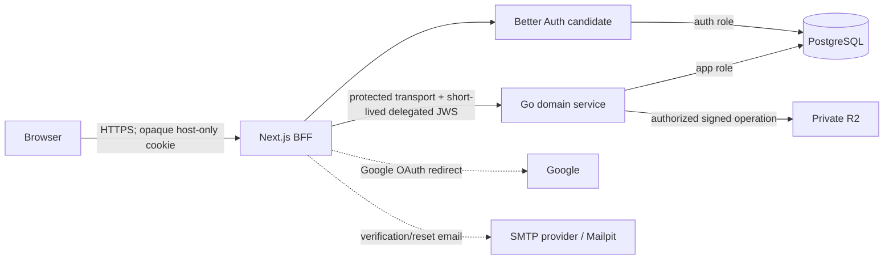

# Quorum auth v2 normative contract

**Status:** architecture selected; provisional policy approval pending  
**Owner:** project owner  
**Last updated:** 2026-07-24

This document states what the implementation must make true. `MUST`, `MUST NOT`, `SHOULD`, and `MAY` are normative. Invariant IDs are permanent; never renumber them. If an invariant changes, supersede it through `DECISIONS.md` and record migration and test consequences.

## 1. System invariants

### Architecture

| ID | Invariant |
|---|---|
| SYS-01 | Browser product requests MUST go only to Next. OAuth redirects and narrowly scoped object transfers to allowlisted third parties are the only exceptions. |
| SYS-02 | Next MUST own browser authentication, session termination, CSRF/origin enforcement, SSR, and UI-shaped composition. Go MUST own product authorization, workflow state transitions, transactions, and application-data writes. |
| SYS-03 | Go MUST NOT trust browser-supplied identity, email, role, account state, ownership, approval, or capability data. |
| SYS-04 | A private network is defense in depth, not authentication or protected transport. Every Next-to-Go request MUST authenticate the Next workload and use a confidential, integrity-protected channel. Authenticated-user calls carry delegated user context; explicitly public calls carry the anonymous variant. |
| SYS-05 | No public launch with real users may occur until `G8 Release-ready` passes. |

### Identity and enrollment

| ID | Invariant |
|---|---|
| ID-01 | Product users MUST have an internal UUID. The auth deployment user MUST be linked by a unique `(identity_realm, identity_subject)` pair, where `identity_subject` is the accepted auth system's stable user ID (initially Better Auth user ID), not a Google/Microsoft/provider-account subject. Email is mutable metadata, never an identity or privilege key. |
| ID-02 | `STUDENT` and `SPONSOR` enrollment MUST be public. `PROFESSOR` and `ADMIN` grants MUST be controlled and audited. |
| ID-03 | Sponsor self-selection MUST NOT grant publication trust. Project state and approval are server-owned. |
| ID-04 | Automatic account linking based only on matching email MUST be disabled. |
| ID-05 | Provisioning MUST be idempotent. Duplicate callbacks or retries MUST NOT create duplicate users, identities, grants, or side effects. |
| ID-06 | Provider subject, provider, realm, email-verification time, linking events, and security-relevant account changes MUST be auditable without logging credentials. |
| ID-07 | The data model MUST support a future Microsoft/Entra identity without changing the product user primary key or authorization model. |
| ID-08 | Provider accounts and provider subjects MUST remain auth-system-owned links beneath one auth user. Linking Google and password to one auth user MUST continue to resolve one Quorum product user. |

### Sessions and authentication

| ID | Invariant |
|---|---|
| SES-01 | The only reusable browser authentication credential MUST be an opaque, `Secure`, `HttpOnly`, host-only session cookie. Short-lived purpose-bound OAuth state/PKCE/nonce and CSRF helper cookies are allowed when maintained by the framework with equivalent secure attributes; they are not general session credentials. No reusable auth credential may appear in browser-readable storage or response JSON. |
| SES-02 | Sessions MUST be database-backed, individually listable, and immediately revocable. Session-cookie/database caching is disabled for the POC unless a later ADR proves revocation semantics. |
| SES-03 | Real `authenticated_at`, authentication methods (`amr`), and assurance MUST survive session refresh and rotation. Refresh MUST NOT manufacture recent authentication. |
| SES-04 | Suspension/deactivation MUST commit immediate Go-side denial and a durable, retrying auth-session revocation command. |
| SES-05 | Login MUST rotate any pre-authentication session identifier. Password/security/linking changes MUST rotate or revoke affected sessions according to the operation's contract. |
| SES-06 | Session credentials, OAuth verifiers, signing keys, and action secrets MUST NOT enter logs, traces, analytics, screenshots, evidence, or unrelated URLs. One-use OAuth authorization codes and verification/reset tokens MAY appear only in their exact purpose-bound HTTPS callback/action URL, followed by immediate one-use exchange, URL cleanup, `Referrer-Policy: no-referrer`, and no third-party resources on token-processing pages. |
| SES-07 | Ordinary session limits are provisionally 24-hour idle and 7-day absolute. Privileged actions require authentication within 10 minutes. These values MUST be represented by tested configuration, not scattered constants. |
| SES-08 | The acceptance spike MUST determine whether the selected framework stores a database value that is directly reusable as a session credential. Prefer a non-reversible digest; otherwise require an explicit risk decision and strict database isolation. Do not invent an incompatible token-storage patch. |
| SES-09 | A production database restore MUST NOT reopen restored sessions. Before traffic resumes, advance a global/session security epoch where supported or revoke/delete every restored session and require fresh authentication. |

### OAuth and password flows

| ID | Invariant |
|---|---|
| OAUTH-01 | OAuth MUST use maintained framework support for authorization-code flow, PKCE, state, nonce where applicable, exact callbacks, allowlisted return paths, and one-use callback state. |
| OAUTH-02 | Login, signup, callback, cancellation, provider denial, retry, replay, and account-collision behavior MUST be explicitly tested. |
| OAUTH-03 | A provider ID token MUST NOT be used as Quorum's general API token. |
| OAUTH-04 | Linking a new provider MUST require a recent authenticated session plus successful control of the new provider. Unlinking MUST not leave the account without a usable authentication method. |
| PASS-01 | Password hashing, verification, reset-token handling, and verification-token handling MUST be delegated to a maintained auth framework/library. Quorum MUST never receive or persist plaintext beyond the framework's request handling. |
| PASS-02 | The single-factor general-user POC password input MUST require at least 15 Unicode code points, accept at least 64 (target maximum 128), allow Unicode/space as supported, permit password managers and paste, avoid composition rules, never silently truncate, and reject common/breached values through a maintained privacy-preserving mechanism. The accepted framework's documented Unicode/normalization behavior, limits, and failure behavior are tested configuration; Quorum does not add ad hoc plaintext transformations. |
| PASS-03 | Signup, reset, and resend responses MUST resist account enumeration. Rate limits MUST cover account, IP/network, and global abuse dimensions. |
| PASS-04 | Verification and reset links MUST be one-use, purpose-bound, expiring, and invalidated after successful use or relevant account changes. |
| SYNC-01 | Auth-to-product security events MUST be transactionally enqueued with the auth mutation when the accepted provider supports it. Otherwise, hooks MUST be backed by versioned periodic reconciliation; hook execution alone is not durability evidence. |
| SYNC-02 | Product identity state MUST record sync version/status/time. Verified-email-gated actions MUST fail closed when required auth state is stale, pending, poisoned, or beyond the approved freshness window. |

### Authorization and API

| ID | Invariant |
|---|---|
| AUTHZ-01 | Authorization MUST be deny-by-default and evaluate actor, current grants, relationship, resource state, action, and requested output fields. |
| AUTHZ-02 | Direct-ID, list, nested edge, search, export, file, notification, and cached access MUST enforce equivalent policy. |
| AUTHZ-03 | Public, authenticated viewer, self/owner, reviewer, Professor, and Admin outputs MUST use distinct allowlisted shapes. |
| AUTHZ-04 | Browser input MUST express intent only. It MUST NOT set lifecycle status, approval, owner, role, `profileComplete`, audit actor, or other protected fields. |
| AUTHZ-05 | Roles and account state MUST be loaded authoritatively in Go for each security decision. Next MAY use sanitized hints for UI rendering but MUST NOT grant access. |
| AUTHZ-06 | Every allowed matrix row and every deny cell MUST have tests before its operation is exposed in auth v2. |
| GQL-01 | GraphQL remains during auth v2, but browser operations MUST be persisted/allowlisted and bounded by pagination, depth, alias/amount, operation count, cost, rate, body, and deadline controls. |
| GQL-02 | A GraphQL resolver MUST translate protocol input and invoke one application use case. It MUST NOT own product policy, multi-step orchestration, or unbounded graph hydration. |
| GQL-03 | Loaders MUST be request-scoped and authorization-aware. They are performance tools, not authorization mechanisms. |

### Data, files, operations, and maintenance

| ID | Invariant |
|---|---|
| DATA-01 | Target PostgreSQL schemas are `better_auth`, `app`, `integration`, and `audit`, with separate least-privilege roles. Supabase's reserved `auth` schema MUST NOT contain Better Auth objects. Existing `public` tables migrate additively. |
| DATA-02 | `apps/api/migrations` is the single migration history during auth v2. All environments MUST be recreated from it; no hosted-dashboard schema drift is permitted. |
| DATA-03 | Runtime roles MUST NOT own schemas or migrate. The migrator, Better Auth adapter, Go application, and read-only operations roles MUST have separate privileges. |
| FILE-01 | Files MUST be private by default. PostgreSQL stores object keys and metadata, never a durable public resume/document URL. |
| FILE-02 | Every upload and download MUST authorize the actor, owner/relationship, purpose, resource state, type, size, and quota. Signed URLs MUST be short-lived and narrowly scoped. |
| OPS-01 | Production MUST fail closed on missing secrets, insecure origins, demo mode, test plugins, placeholder configuration, or an unverified migration state. |
| OPS-02 | Secrets MUST be environment/secret-manager supplied, rotatable, access-scoped, and absent from images, source, logs, test evidence, and client bundles. |
| OPS-03 | Suspension, deletion, secret rotation, provider outage, database outage, email outage, restore, and rollback MUST have tested runbooks. |
| OPS-04 | Security-sensitive outward URLs MUST derive from configured canonical origins. Forwarded headers MAY be trusted only from the selected proxy/platform, with host-header and proxy-spoof tests. |
| TEST-01 | Every critical/high audit defect and every authorization deny cell MUST have a named regression test. Required suites MUST fail instead of silently skipping. |
| MIG-01 | Database changes MUST be additive until cutover. Destructive identity/session reset requires verified inventory, rollback plan, confirmation that there are no real users, and either a verified backup or an explicit recorded owner acceptance that the named dataset is disposable and may be lost. |
| PERF-01 | GraphQL versus typed HTTP MUST be decided from representative query counts, p50/p95/p99 latency, pool saturation, security burden, and maintenance evidence—not preference. |
| MAINT-01 | Transports MUST remain thin. Domain packages MUST NOT import gqlgen, HTTP, Better Auth, Next, or generated sqlc row types. Dependencies point inward. |
| MAINT-02 | A generated or compile-time checked Next-to-Go contract MUST prevent field-name/header drift. Deployments MUST tolerate compatible rolling versions. |

## 2. Target topology



Only Next is browser-facing. Production Next-to-Go transport MUST be one of: a restrictive Unix-domain socket; mTLS; or provider-private transport explicitly proven to supply confidentiality and integrity. Public/cross-provider ingress additionally requires HTTPS plus the delegated JWS. Go may have non-browser public ingress only if a deployment constraint forces it and an accepted service-auth design protects it. An Internet-routable service is not called private merely because CORS is disabled.

## 3. Responsibility boundaries

| Concern | Next / Better Auth | Go | PostgreSQL / storage |
|---|---|---|---|
| OAuth/password verification | Owns | Never performs login | Auth records persist in `better_auth` |
| Browser cookie/session | Owns and sanitizes | Never receives cookie/token | Session record persists in `better_auth` |
| Product user mapping | Emits auth-deployment realm and stable auth user ID | Resolves/creates idempotent app binding | Unique realm/auth-user mapping |
| Product roles | May display nonauthoritative hints | Sole policy owner | Audited role grants |
| Resource authorization | May narrow/omit | Sole grant/deny authority | Constraints and relationship state |
| Workflows/transactions | Calls typed use cases | Owns | Constraints, locks, transactions |
| Public/view models | Composes and further redacts | Authorizes fields and returns allowed shape | No browser Data API |
| Suspension/deletion | Revokes auth sessions via durable command | Denies immediately; owns product state | Outbox/inbox reconciles boundaries |
| Files | Never returns durable public URL | Authorizes metadata/signing | Private R2 objects and metadata |
| Audit | Adds request/correlation context | Records product/security events | Append-oriented audit records |

Next creates authenticated session context, not the authoritative product `Principal`. Go alone constructs the principal after loading current account state, role grants, memberships, ownership, and relevant resource state.

## 4. Identity and role model

### Product identity

The minimum target model is:

```text
app.users
  id UUID primary key
  status PENDING_PROVISIONING | ACTIVE | SUSPENDED | DEACTIVATED | DELETION_PENDING | DELETED
  created_at / updated_at

app.auth_user_bindings
  id UUID primary key
  user_id -> app.users.id
  identity_realm TEXT
  identity_subject TEXT  # stable auth-deployment user ID, not provider account subject
  verified_email_snapshot nullable
  verified_at nullable
  auth_sync_version TEXT nullable
  auth_sync_status CURRENT | PENDING | STALE | ERROR
  auth_last_synced_at nullable
  bound_at / unbound_at nullable
  unique(identity_realm, identity_subject)

app.role_grants
  id UUID primary key
  user_id -> app.users.id
  role STUDENT | SPONSOR | PROFESSOR | ADMIN
  scope_type GLOBAL | UNIVERSITY | PROGRAM | PROJECT
  scope_id nullable
  source SELF_SERVICE | INVITATION | ADMIN_GRANT | MIGRATION
  granted_by_user_id nullable
  granted_at / revoked_at nullable
```

Email snapshots support communication and invitation matching but do not replace realm/subject identity. Google/password/Microsoft account records and their provider subjects live in Better Auth; they are not separate Quorum users. Any verification/email/link change from Better Auth must reach Go through a transactional outbox or reconciliation before a verified-email-gated product operation succeeds.

### Enrollment rules

- A new verified auth user may request `STUDENT` or `SPONSOR`. Go validates that the requested grant is in that exact public set and records its source.
- Public roles are not arbitrary mutable profile fields. A later role change is a use case with audit history.
- A user may eventually hold both public roles; the initial UI may ask for one primary path. Authorization checks grants, not a client-selected active role.
- Professor comes only from a scoped invitation or an Admin grant.
- Admin comes only from an audited bootstrap/admin grant. No request-time email list is consulted.
- The first Admin bootstrap uses a one-time operator command against an already verified internal user UUID, shows the intended subject for confirmation, records an audit event, and disables/restricts reuse.

## 5. Account and session state machines

### Product account

```text
PENDING_PROVISIONING -> ACTIVE
ACTIVE -> SUSPENDED -> ACTIVE
ACTIVE -> DEACTIVATED -> ACTIVE
ACTIVE|SUSPENDED|DEACTIVATED -> DELETION_PENDING -> DELETED
```

- Unknown states deny.
- `SUSPENDED`, `DEACTIVATED`, `DELETION_PENDING`, and `DELETED` cannot execute product actions.
- Reactivation does not silently recreate revoked sessions.
- Deletion retention/anonymization rules are finalized in D-026 before real data.

### Session

```text
CREATED -> ACTIVE -> ROTATED -> ACTIVE
ACTIVE -> IDLE_EXPIRED | ABSOLUTE_EXPIRED | REVOKED
```

- A rotated credential invalidates the previous credential according to tested framework behavior.
- Logout current revokes the current session; logout all revokes every user session.
- Password reset/change, sensitive link/unlink, suspension, and suspected compromise revoke the required session set.
- Device management exposes only a user-scoped nonauthenticating `device_handle`, approximate metadata, and timestamps—not raw session IDs/tokens.

### Project publication

```text
DRAFT -> PENDING_REVIEW
PENDING_REVIEW -> CHANGES_REQUESTED -> DRAFT
PENDING_REVIEW -> REJECTED -> DRAFT (new revision)
PENDING_REVIEW -> APPROVED -> PUBLISHED
PUBLISHED -> ARCHIVED
```

- Sponsor/owner commands create and edit only `DRAFT`, submit a valid draft, and request archival of an owned project where policy permits.
- Professor within approved scope or Admin may review through dedicated commands; generic create/update inputs never set these states.
- `APPROVED` is not public until the separate publish transition succeeds. A single atomic approve-and-publish command MAY collapse those transitions while still recording both facts/audit semantics.
- Every transition validates the current state in the same transaction, records actor/reason/audit event, and is idempotent under retry.
- Unknown/invalid transitions deny. Direct reads use the resulting state; they do not bypass it.

### Privileged invitation

```text
ISSUED -> ACCEPTED
ISSUED -> EXPIRED
ISSUED -> REVOKED
```

- Only an authorized Admin may issue a Professor invitation; Admin grants use the separate bootstrap/admin-grant ceremony.
- Store a high-entropy token digest, purpose, role, scope, normalized invited email where applicable, issuer, issue/expiry times, and status. Never store or log the raw token after delivery.
- Acceptance requires a recent authenticated session plus a fresh server-generated verified-identity proof matching the invitation. Browser-supplied email is never proof.
- Acceptance and the audited role grant commit atomically. A retry by the same accepted account is idempotent; another account is denied.
- Expired, revoked, wrong-purpose, replayed, or mismatched tokens grant nothing. A mismatch is rate-limited/audited and does not expose who was invited.
- Reissue creates a new token and revokes the old outstanding invitation. Revocation and expiry are irreversible for that token.
- Invitation/action pages follow the token-URL protections in SES-06.

## 6. Browser session and request contract

Production cookie target:

```text
Name: __Host-quorum_session (or framework-equivalent proven by A03)
Secure: true
HttpOnly: true
SameSite: Lax unless a documented flow requires stricter/different behavior
Path: /
Domain: absent
```

Local HTTP may require the framework's documented development exception; production configuration must fail closed if `Secure` cannot be set.

Every custom state-changing BFF route must:

1. validate the session server-side;
2. validate exact `Origin` against the configured application origin;
3. enforce appropriate Fetch Metadata and CSRF protection;
4. validate content type, body size, and typed input;
5. rate-limit the use case;
6. create a correlation ID and deadline;
7. call an allowlisted internal operation;
8. return an allowlisted response with `Cache-Control: no-store` where viewer/session-specific;
9. avoid distinguishing nonexistent accounts in sensitive flows.

Auth/session responses must be explicitly projected. A catch-all framework route may not serialize a reusable session credential simply because the framework exposes that field by default.

OAuth, verification, reset, invitation, and other security-sensitive outward URLs derive from the configured canonical origin, never arbitrary `Host`, `Forwarded`, or `X-Forwarded-*` input. A reverse proxy/platform is trusted only after its exact proxy ranges/header behavior are configured and tested. Token-processing pages set `Referrer-Policy: no-referrer`, load no third-party resources, exchange once, and replace/clean the URL before rendering general application content.

## 7. Google and password flow contracts

### Google new-user flow

```text
start -> framework creates protected state/PKCE -> Google -> exact callback
      -> framework validates callback -> database session
      -> idempotent app provisioning -> public-role onboarding
      -> one allowed viewer operation -> destination
```

The callback must not request protected product state until the framework session exists. The destination is an allowlisted relative route, never an arbitrary URL. Provisioning failure leaves a reconcilable auth record and does not create a partially privileged product user.

### Google returning-user flow

The realm/subject resolves exactly one active product user. If the account is suspended/deactivated/deleted, Go denies immediately and the revocation saga removes auth sessions. A changed verified email does not change identity.

### Email/password flow

- Signup produces a verification-pending account/session behavior explicitly chosen during `A03`.
- Unverified users can only view/resend verification and perform safe account actions.
- Verification success emits a durable event and enables the approved product gates.
- Password reset returns the same outward result for existing/nonexisting addresses, with rate limits.
- Successful reset revokes all previous sessions unless the accepted framework contract provides a stronger reviewed behavior.

### Email change

- A password-account email change requires recent authentication and, where configured, current-factor/MFA proof.
- The new address remains pending until its one-use verification succeeds. The old address receives a security notification without a reversal secret that bypasses authentication.
- Collision with another auth user or provider-account policy fails safely and does not auto-link accounts.
- Starting/completing the change invalidates or re-evaluates outstanding verification, reset, invitation, and linking tokens whose identity assumptions changed.
- Completion rotates/revokes the session set selected in the accepted framework contract and emits a transactionally durable/reconcilable auth event.
- Provider-managed email changes are ingested from the auth system; product profile email input cannot overwrite verified identity state.

### Admin MFA and privileged recovery

- An Admin grant is not active for privileged use until an accepted MFA factor is enrolled and verified.
- Privileged actions require a recent step-up whose assurance/`amr` mapping is proven during `A03`/`A07M`.
- `A07M` must define enrollment, challenge, replay/rate limits, factor listing, factor add/remove/change, backup/recovery material if supported, lost-factor recovery, and session revocation.
- Factor removal/change requires recent MFA or the controlled recovery ceremony and notifies the account through an independent channel where available.
- The initial one-time Admin bootstrap is permanently disabled/consumed after use. Break-glass recovery is a separate audited operator process; there is no standing bypass or email allowlist.
- MFA provider/storage outage fails privileged operations closed. General nonprivileged product access follows its normal session policy.

## 8. Next-to-Go internal contract

### Two distinct facts

1. The caller is the Quorum Next workload.
2. The workload is acting either for a particular authenticated auth user/session or for an explicitly anonymous public request.

The initial portable design uses a maintained JOSE implementation and an asymmetric short-lived JWS. Next holds the signing private key; Go holds only verification keys. The Go endpoint is still private/non-browser-facing. JWS authenticates the service/delegated context; the channel separately supplies confidentiality and request/response integrity through restrictive UDS, mTLS, or a provider transport proven equivalent. Do not assume an ordinary unencrypted private TCP network provides those properties.

Required protected claims:

| Claim | Rule |
|---|---|
| `typ` | Exact internal assertion type, versioned |
| `iss` | `quorum-web-service` or environment-specific accepted issuer |
| `aud` | Exact Go service audience |
| `iat`, `nbf`, `exp` | Strictly validated; lifetime no more than 60 seconds with bounded skew |
| `jti` | Unique assertion ID for logs/replay observation; no credential meaning |
| `actor_kind` | Exact `AUTHENTICATED` or `ANONYMOUS` value |
| `identity_realm` | Required only for authenticated actor; versioned auth-deployment namespace, distinct from service issuer |
| `sub` | Required only for authenticated actor; stable auth-deployment user ID (initially Better Auth user ID), never a provider-account subject or browser-supplied product UUID |
| `authenticated_at` | Authenticated actor only; original authentication event, not session refresh time |
| `amr`, `assurance` | Authenticated actor only; framework-derived authentication context |
| `device_handle` | Authenticated actor only; nonsecret, user-scoped UI handle only |
| `correlation_id` | End-to-end request correlation |

For `ANONYMOUS`, `identity_realm`, `sub`, `authenticated_at`, `amr`, assurance, and device handle are absent. Go constructs an anonymous principal that can invoke only explicitly public persisted operations. An authenticated operation rejects an anonymous assertion; anonymous requests never fabricate a user subject.

The assertion carries no role, permission, ownership, approval, profile-complete flag, or generic email authority. A narrowly scoped invitation operation may additionally use a server-generated verified-identity proof containing normalized verified email and verification time; it is purpose/audience-bound and never accepted as a general principal attribute.

Go must validate algorithm, type, key ID, signature, issuer, audience, actor-kind claim set, timestamps, lifetime, and key rotation. Unknown keys are bounded; no unbounded remote key fetch occurs per request. Domain commands remain idempotent. Retries apply only to idempotent operations. Deadlines, cancellation, correlation IDs, and overload responses cross the boundary.

The JWS is intentionally not a home-grown method/path/body signing protocol. Protected transport prevents network mutation/eavesdropping; application operation allowlisting and typed inputs prevent the assertion from authorizing arbitrary work. A captured assertion may replay only inside its very short validity window; logout cannot retroactively erase an already minted assertion. Target 15 seconds and never exceed 60 seconds. If the deployment threat model requires one-use assertions, add an atomic shared `jti` store or a standard platform mechanism through a separate ADR. Tests must cover captured replay bounds, body/operation tampering over a test interception proxy, and rejection outside the protected deployment topology.

## 9. Cross-boundary lifecycle and reconciliation

Auth and product data do not assume one framework transaction. Use durable idempotent inbox/outbox processing plus reconciliation where atomic event creation cannot be proven. Durable workers run as separate non-public processes, never fire-and-forget work attached to a web request.

### Go to auth

For suspension/deactivation/deletion/security revoke:

1. Go commits authoritative product denial plus an `integration` outbox command in one transaction.
2. A separately deployed Next/auth worker consumes the command idempotently using a lease/`SKIP LOCKED`-equivalent claim.
3. Better Auth sessions/accounts are revoked or updated.
4. Delivery retries with backoff until acknowledged.
5. Exhausted/aged work alerts an operator; product denial remains active meanwhile.

### Auth to Go

During `A03`, prove whether accepted-provider hooks can enqueue an event in the same database transaction as the auth mutation. If they can, use a transactional auth outbox. If they cannot, hooks enqueue best-effort events and a versioned scheduled reconciler compares provider state with `app.auth_user_bindings`. Hooks by themselves are not called durable.

Auth events/reconciliation cover:

- email verified or changed;
- provider linked/unlinked;
- password/security change;
- auth account deletion;
- session-security context changes relevant to product policy.

Go consumes them idempotently. Each binding records `auth_sync_version`, `auth_sync_status`, and `auth_last_synced_at`. Verified-email-gated operations fail closed while required identity state is stale, pending, errored, or older than the approved maximum freshness. The worker handles bounded concurrency, exponential retry, duplicate/reordered events, poison-message quarantine/alerting, graceful shutdown, and backlog/oldest-age metrics.

Tests deliberately drop, duplicate, reorder, and poison events; stop the worker/reconciler; change email/link/verification state while stopped; and prove reconciliation repairs state without granting from stale snapshots.

## 10. PostgreSQL and migration contract

- One PostgreSQL cluster/database may host auth and product schemas, but ownership is separated.
- An idempotent operator-only role bootstrap creates NOLOGIN owner roles plus LOGIN `quorum_migrator`, `quorum_auth_runtime`, and `quorum_app_runtime` roles. Credentials are injected by the provider/secret manager, never stored in migrations.
- NOLOGIN schema-owner roles own controlled objects. Runtime roles own nothing, cannot create schemas/tables, and have no broad role inheritance.
- `quorum_auth_runtime` can use only `better_auth` plus narrow `integration` procedures/tables.
- `quorum_app_runtime` can use only `app`, `audit`, and narrow `integration` objects; it cannot read session credentials/password material.
- A read-only operations role receives only explicitly approved views.
- Runtime roles do not inherit Supabase-wide `service_role` powers.
- If managed Supabase is selected, disable the Data API or remove exposed schemas/grants. Browser publishable keys are unnecessary.
- Revoke `CREATE` on `public` from `PUBLIC`; explicitly grant schema/table/sequence/function rights and configure `ALTER DEFAULT PRIVILEGES FOR ROLE <owner>` for future objects. If Supabase hosts PostgreSQL, revoke its Data-API roles on current and default application/auth objects unless an ADR exposes a dedicated API schema.
- Every migration is transactional where PostgreSQL permits, uses an advisory lock plus statement/lock timeouts, includes immutable checksum and forward/rollback/mitigation notes, and is tested from empty and N-1 databases. Nontransactional migrations require a separate reviewed runner path; the default runner rejects them.
- Better Auth's CLI may generate SQL for the pinned version in an isolated database whose search path is exactly `better_auth, pg_catalog, pg_temp`. Review and schema-qualify every object or begin the migration transaction with an equivalent `SET LOCAL search_path`; assert `current_schema() = 'better_auth'`. CI fails if any Better Auth object lands in `public` or Supabase `auth`. Commit the SQL as a numbered Quorum migration; never let production application startup mutate schema.
- PostgreSQL roles are cluster-global and are not recreated by an ordinary schema/data dump. Restore/bootstrap roles and ownership first, then restore schemas/data and reapply/verify grants.

Moving all existing public tables into `app` is not a prerequisite for the first slice. Start additively with auth-user bindings, role grants, lifecycle fields, integration queues, and least-privilege roles. A later migration may qualify/move legacy tables after sqlc/query dependency mapping.

## 11. Authorization matrix

`ALLOW` means the row is intended policy; it still requires field projection and state checks. `DENY` is the default. `PROVISIONAL` requires owner approval at `A01` or before `G6`.

### Enrollment and global administration

| Action | Visitor | Verified user | Student | Sponsor | Professor | Admin |
|---|---:|---:|---:|---:|---:|---:|
| Register/login | ALLOW | ALLOW | ALLOW | ALLOW | ALLOW | ALLOW |
| Self-request Student grant | DENY | ALLOW | ALLOW/idempotent | ALLOW | ALLOW | ALLOW |
| Self-request Sponsor grant | DENY | ALLOW | ALLOW | ALLOW/idempotent | ALLOW | ALLOW |
| Grant/revoke Professor | DENY | DENY | DENY | DENY | DENY | ALLOW |
| Grant/revoke Admin | DENY | DENY | DENY | DENY | DENY | ALLOW with recent MFA/audit |
| Suspend/reactivate account | DENY | DENY | DENY | DENY | PROVISIONAL limited escalation | ALLOW with recent MFA/audit |
| Read global security audit | DENY | DENY | DENY | DENY | DENY | ALLOW with recent MFA |

### Profiles and discovery

| Resource/action | Visitor | Authenticated user | Self | Professor | Admin |
|---|---:|---:|---:|---:|---:|
| Sanitized approved project summaries | ALLOW | ALLOW | ALLOW | ALLOW | ALLOW |
| Student public profile | DENY by default | ALLOW only if explicit visibility/policy | ALLOW | PROVISIONAL academic scope | ALLOW for operations |
| Sponsor public card attached to published project | ALLOW sanitized | ALLOW | ALLOW | ALLOW | ALLOW |
| Private contact, resume, provider subject, identity list | DENY | DENY | ALLOW appropriate fields | DENY unless explicit academic purpose | ALLOW only purpose-scoped/audited |
| Edit profile | DENY | DENY | ALLOW safe fields | DENY | DENY except explicit moderation use case |
| Set role/status/approval/profile-complete directly | DENY | DENY | DENY | DENY | DENY; dedicated use cases only |

### Teams

| Action | Visitor | Student nonmember | Team member | Team lead | Sponsor | Professor | Admin |
|---|---:|---:|---:|---:|---:|---:|---:|
| List discoverable team summaries | DENY | ALLOW sanitized | ALLOW | ALLOW | DENY unless needed | PROVISIONAL academic scope | ALLOW |
| Read private team details | DENY | DENY | ALLOW | ALLOW | DENY | PROVISIONAL academic scope | ALLOW audited |
| Create team | DENY | ALLOW | ALLOW if policy permits | ALLOW | DENY unless also Student | DENY | DENY |
| Edit team/recruitment | DENY | DENY | DENY except member leave | ALLOW | DENY | DENY | Moderation use case only |
| Add/remove member or change lead | DENY | DENY | DENY | ALLOW subject to workflow | DENY | DENY | Recovery/moderation only, audited |
| Associate arbitrary project/team ID | DENY | DENY | DENY | DENY; only accepted workflow transition | DENY | DENY | DENY outside dedicated recovery |

### Projects

| Action/state | Visitor | Student/team | Owning Sponsor | Other Sponsor | Professor | Admin |
|---|---:|---:|---:|---:|---:|---:|
| Read approved/published summary | ALLOW sanitized | ALLOW | ALLOW | ALLOW | ALLOW | ALLOW |
| Read draft/rejected/archived/private data | DENY | DENY | ALLOW own | DENY | PROVISIONAL review scope | ALLOW audited |
| Create draft | DENY | DENY | ALLOW | ALLOW | ALLOW if sponsor grant also held | ALLOW only explicit admin workflow |
| Edit own draft | DENY | DENY | ALLOW | DENY | DENY | Moderation use case only |
| Submit for review | DENY | DENY | ALLOW own valid draft | DENY | DENY | DENY |
| Approve/reject/publication transition | DENY | DENY | DENY | DENY | PROVISIONAL ALLOW within scope | ALLOW |
| Archive published project | DENY | DENY | ALLOW own through rules | DENY | PROVISIONAL | ALLOW |
| Set owner/approval/status via generic input | DENY | DENY | DENY | DENY | DENY | DENY; dedicated commands only |

### Applications, offers, messages, and reviews

| Action | Visitor | Applicant team | Team lead | Project owner | Professor | Admin |
|---|---:|---:|---:|---:|---:|---:|
| Create application | DENY | DENY | ALLOW for owned eligible team | DENY | DENY | DENY |
| Read application answers/messages | DENY | ALLOW own team according to state | ALLOW own | ALLOW own project | DENY by default; PROVISIONAL appeal scope | ALLOW only audited support purpose |
| Review/shortlist/reject | DENY | DENY | DENY | ALLOW own project | DENY by default | Recovery/moderation only |
| Send/accept/decline offer | DENY | Team-authorized accept/decline | ALLOW own team | ALLOW send for own project | DENY | Recovery only |
| Read/send conversation message | DENY | Participants only | Participants only | Participants only | DENY unless explicit reported-content workflow | Reported-content workflow only, audited |
| Export applications/private answers | DENY | DENY | DENY | ALLOW own project if product supports | PROVISIONAL academic report with minimization | ALLOW purpose-scoped/audited |

### Files

| File/action | Public | Authenticated unrelated | Owner/authorized participant | Professor | Admin |
|---|---:|---:|---:|---:|---:|
| Public project marketing asset explicitly marked public | ALLOW through sanitized delivery policy | ALLOW | ALLOW | ALLOW | ALLOW |
| Resume/avatar/private portfolio/project attachment | DENY | DENY | ALLOW by exact resource policy | PROVISIONAL academic scope; no blanket access | Purpose-scoped/audited only |
| Create signed upload | DENY | DENY | ALLOW within purpose/type/size/quota | Same policy as owner role | Support use case only |
| Create signed download | DENY | DENY | ALLOW after current authorization | Scope/purpose checked | Purpose/audit checked |
| Change durable public URL/ACL | DENY | DENY | DENY | DENY | DENY through application; operator runbook only |

## 12. GraphQL exposure contract

During migration:

- The browser may call a same-origin Next route using a registered operation ID and typed variables. Raw arbitrary query text is rejected.
- Next maps the operation ID to a reviewed persisted document or typed internal use case.
- Go authenticates only the internal assertion, resolves the principal, authorizes root and nested fields, and returns an allowlisted shape.
- New auth-v2 exposure begins with one viewer operation. Every legacy operation remains unreachable through auth v2 until its matrix/tests pass.
- Direct Go introspection/playground is development-only and never browser/public in production.
- Every list is paginated with maximum page size. Every request has body, variable, depth, alias/amount, operation-count, cost, rate, and deadline bounds.
- Raw internal/database errors are mapped to stable public errors and correlation IDs.

### First authenticated operation: `ViewerBootstrapV1`

`ViewerBootstrapV1` is the only authenticated product operation exposed by the first vertical slice. It accepts no browser-provided identity, email, role, account-state, or resource-ownership input. Next authenticates the opaque browser session, creates the short-lived internal assertion, and invokes the registered operation; Go resolves the authoritative product principal.

The exact response allowlist is:

```text
viewer:
  productUserId: UUID
  accountState: ACTIVE | SUSPENDED | DEACTIVATED | DELETED
  onboardingState: NOT_STARTED | IN_PROGRESS | COMPLETE
  username: String?
  displayName: String?
  selfServiceRoles: [STUDENT | SPONSOR]
```

`selfServiceRoles` is a navigation hint only and never authorization evidence. The response MUST NOT include provider subjects, auth deployment/user IDs, email, verification tokens or raw verification state, session IDs/tokens, Professor/Admin grants, private profile fields, file/object URLs, or a generic full-profile object. Unknown, inactive, or ambiguously bound principals fail closed with stable nonleaking errors. Provisioning, if performed by the vertical slice, is idempotent and keyed only by the accepted auth deployment's user ID. The response is `Cache-Control: private, no-store`, and the browser cache is cleared on logout/account change.

Anonymous discovery is a separate operation and projection. It may expose only approved/published project summaries and explicitly public sponsor fields under D-021; it never shares the viewer response type.

## 13. File contract

- Buckets are private.
- Upload intent creates server-owned metadata with purpose, owner/resource, expected content type/size, status, and expiry.
- Object keys are unguessable but secrecy of the key is not authorization.
- Finalization verifies size/type and, where required, scanning/quarantine before use.
- Download signing happens only after a current Go authorization decision.
- Signed URLs expire quickly and are never persisted as the canonical file location.
- Replacement/deletion cleans old objects idempotently; orphan cleanup is observable and retryable.
- R2 emulators validate workflow shape only. A real-R2 contract suite verifies actual signing/API differences before release.

## 14. Errors, caching, logging, and privacy

- A `401` means no valid authentication. A `403` means authenticated but denied. Provider cancellation, callback failure, suspended account, and backend outage have distinct nonleaking user messages.
- Do not map every authentication failure to “session expired.”
- Session/viewer-specific server responses use `private, no-store` unless a reviewed cache key includes every security dimension.
- Client query caches are scoped by viewer/session and cleared on logout, account switch, revocation signal, and cross-tab sign-out.
- Security logs use internal user ID, event type, result, reason code, request/correlation ID, approximate network/device metadata, and timestamp. They exclude secrets and unnecessary personal fields.
- Public responses never contain provider subjects, private email, resumes, application answers, internal moderation notes, or reusable identifiers solely because the database row contains them.

## 15. Definition of an auth-v2 release

Auth v2 is not release-ready until:

1. every invariant relevant to the released surface has named passing tests;
2. all critical/high audit findings have regression coverage;
3. all exposed operations and fields have approved authorization rows;
4. no browser-readable reusable credential exists;
5. Go trusts only a verified service assertion over a confidential/integrity-protected channel and resolves current principal state; anonymous calls use only the explicit anonymous variant;
6. suspension, auth-state reconciliation, and revocation work during dropped events, retries, and outages;
7. files are private and current-policy authorized;
8. migrations reproduce an empty database and restore succeeds;
9. demo/test bypasses fail production startup;
10. Admin MFA and separate break-glass recovery pass before privileged release;
11. real Google and production email flows pass on the selected hostname/proxy without host/referrer leakage;
12. restore invalidates restored sessions and recreates role ownership/grants;
13. performance/connection/query-count evidence meets the approved budget;
14. the project owner approves `G8` with rollback and incident runbooks.
