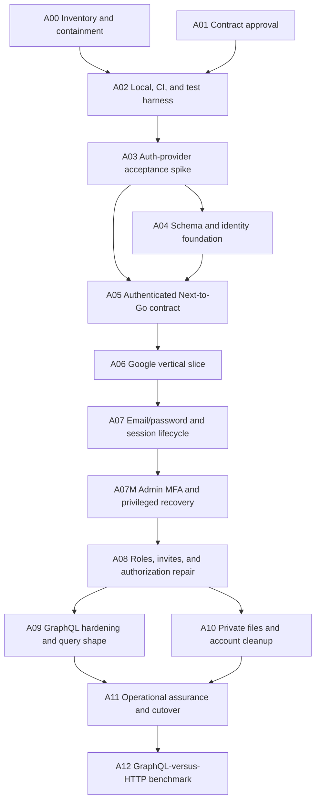

# Auth v2 implementation plan

**Method:** contract-first, outside-in, test-first vertical slices  
**Owner:** project owner  
**Last updated:** 2026-07-24

This plan is executable only together with `STATUS.md`, `DECISIONS.md`, `AUTH_V2_CONTRACT.md`, and `VERIFICATION.md`. Task IDs and gate IDs are permanent.

## 1. Execution rules

- A task starts only when every dependency is `done`.
- A task implements only its listed scope. Discoveries become a new task/decision, not hidden scope expansion.
- Write or identify a failing test before product implementation.
- A coding agent may move a task to `in_review`; only the project owner may pass a security phase gate.
- Required tests fail when dependencies are missing. They never report success by skipping.
- Each task must remain safely reversible through code rollback and additive database compatibility.
- The legacy system stays non-public during the migration. No user traffic is used as a test harness.
- Auth framework, domain policy, GraphQL transport, and deployment-provider changes are separate decisions.

## 2. Dependency graph



`A00` and `A01` may proceed in parallel. No other task may bypass the graph.

## 3. Phase gates

### G0 — Contained

Pass only when:

- every repo-derived environment/database/provider/bucket/host reference is inventoried and the owner completes the external-console attestation checklist;
- the owner confirms there is no deployed public application and no real-user data, or documents exceptions;
- each nonempty database has a restorable backup, unless an accepted decision identifies the exact dataset as disposable and records owner acceptance of total loss; a nonexistent/empty database has a signed owner emptiness attestation;
- demo/reset/impersonation paths are unreachable in anything called production;
- the Google callback failure has a redacted request/redirect/cookie trace or a documented reason runtime capture is impossible;
- critical anonymous exposure cannot reach real data while auth v2 is built;
- legacy conditional Vercel/Fly deployment jobs are disabled/removed until D-023 is accepted; deployment must never report success by silently skipping missing required artifacts.

### G1 — Contract-ready

Pass only when:

- all `ACCEPTED` decisions are acknowledged;
- anonymous/base-role/session/verification rules are approved or narrowed;
- unresolved Professor/Admin actions and bootstrap stay closed/unexposed with D-024 assigned to A08/G6 rather than blocking the harness/provider spike;
- account, session, project, and invitation state machines are accepted;
- the first vertical-slice request/response contract is written;
- every unresolved question has an owner and blocking gate.

### G2 — Harness-ready

Pass only when:

- a fresh clone can start pinned PostgreSQL and Mailpit deterministically;
- every migration applies to an empty database;
- web unit/component, Go unit/integration, and Playwright browser harnesses run in CI, except the project owner may approve the D-033 sequencing exception after complete service-backed local and negative-control evidence;
- database/browser suites fail rather than skip when infrastructure cannot start;
- a temporary negative-control mutation/probe for each harness fails for the intended reason, is reverted, and the clean suite reruns green; no intentionally failing test remains committed;
- Docker build-context archive/sentinel tests provably exclude local secrets. Release-image layer/SBOM/runtime inspection belongs to A11 after Dockerfiles exist.

### G3 — Framework-accepted

Pass only when one exact stable auth-provider release (Better Auth is the first candidate) proves every `SPIKE-*` row in `VERIFICATION.md`:

- if D-033 was used, the exact pinned Ubuntu A02 workflow is green before framework acceptance;
- Next version/runtime compatibility and pinned install;
- password policy and normalization behavior satisfy PASS-02/D-034 without custom plaintext handling;
- migrations in `better_auth`, never Supabase `auth`;
- deterministic OAuth/OIDC code/PKCE/state/nonce/callback behavior; real Google provider smoke is required at G4, not guessed during a secretless CI run;
- opaque `HttpOnly` cookie with no reusable credential in browser JSON/storage;
- idle, absolute, rotation, current/all revocation, and recent-auth semantics;
- `authenticated_at`, `amr`, and assurance survive refresh;
- email verification/reset hooks and Mailpit delivery;
- multi-instance-compatible rate limiting or an accepted POC/production split;
- explicit linking and same-email collision behavior;
- route allowlisting/projection and dependency upgrade procedure;
- database session-token-at-rest behavior is accepted or the candidate is rejected.

Rejecting a candidate does not pass G3 and does not complete A03. Remove the rejected candidate, record the decision, select/test another maintained provider, and keep A04/A05 blocked until one candidate passes.

### G4 — Google-complete

Pass only when new, returning, cancelled, denied, replayed, wrong-origin, expired-state, logout, revoked, and suspended-account Google flows work through Next and the authenticated Go boundary. The browser sees no reusable credential and only one repaired viewer operation is exposed.

### G5 — Session-complete

Pass only when email/password signup, verification, resend, reset, change, enumeration resistance, rate limits, idle/absolute expiry, recent authentication, rotation, list/revoke current/all, device handles, cross-tab logout, and lifecycle revocation all pass.

### G5A — Privileged-auth complete

Pass only when the accepted Admin MFA method proves enrollment-before-privilege, step-up, assurance mapping, challenge replay/rate limits, factor list/add/remove/change, recovery/backup material where supported, lost-factor recovery, session revocation, alerts, and fail-closed outage behavior. Initial bootstrap is consumed/disabled; break-glass is a separate audited process with no standing bypass.

### G6 — Authorization-complete

Pass only when every exposed operation and output field has an approved matrix row plus positive and negative tests. All critical/high authorization audit findings have named regression tests. No generic input can set protected fields.

### G7 — File-complete

Pass only when private defaults, intent, type/size/quota, quarantine/scanning policy, authorized signing, expiry, replacement, deletion, and orphan cleanup pass against an emulator/fake and real R2 contract environment.

### G8 — Release-ready

Pass only when:

- production configuration fails closed;
- real Google and production email flows pass on the selected hostname;
- only Next is public; service authentication plus confidential/integrity-protected Next-to-Go transport are verified in the deployed topology;
- the separate auth/integration worker is deployed, observable, and recovers a deliberately dropped/poisoned/reordered event backlog;
- migrations, N-1-compatible rollback, backup/isolated-restore-with-session-invalidation, key rotation, provider/DB/email outage, suspension, and deletion runbooks pass;
- reverse-proxy/canonical-origin trust and release supply-chain/secret scoping pass;
- SAST/dependency/secret/container checks pass;
- representative 800-user query-count, p50/p95/p99, connection, rate, and overload tests meet approved budgets;
- an independent review finds no unresolved critical/high issue;
- the project owner signs the gate.

### G9 — Transport-decided

Pass after a separate ADR compares retained hardened GraphQL with typed use-case HTTP using measured latency, SQL query count, client composition value, authorization surface, operational controls, and maintenance cost.

## 4. Task cards

### A00 — Inventory and containment

**State:** see `STATUS.md`  
**Dependencies:** none  
**Primary invariants:** SYS-05, OPS-01, OPS-02, MIG-01

In scope:

- Build the repo-derived inventory with `rg` over env key names, workflow/deploy files, DNS/host/provider references, database URLs with values redacted, auth issuers/callback paths, R2 config, and application origins.
- Have the owner attest external consoles for local/remote databases, Neon branches, auth tenants, Google OAuth clients/callbacks, R2 buckets/domains, GitHub environments/secrets, DNS, Vercel/Fly projects, and any university/demo host. If access or attestation is unavailable, mark A00 `blocked`; never assume absence from the repository means absence externally.
- Count product users, external identities, sessions where visible, and stored objects without placing personal data in docs.
- Back up any nonempty database and record restore location/owner without credentials.
- Reproduce the Google error locally if possible and capture a redacted redirect/cookie/status timeline.
- Confirm the application is not public. If it is, disable access or contain every critical exposure before continuing.
- Disable/remove the legacy conditional Vercel/Fly deploy jobs until D-023 selects a topology. A required deployment must fail when config/artifacts are absent, not succeed with a skip notice. Production migration/deploy concurrency is serialized and not cancelled mid-release.
- Resolve the pre-existing `package-lock.json` diff: the owner preserves/commits it or explicitly records it as the dependency baseline before A02/A03. Do not normalize it incidentally.
- Record baseline test results and current dirty worktree files.

Out of scope:

- Replacing Neon Auth.
- Changing product policy.
- Destructive reset or migration.

Required evidence:

- Sanitized inventory table containing `asset type | environment | redacted identifier | owner | console checked | user/data count | public? | backup/evidence | disposition`, plus owner confirmation in `STATUS.md` or a linked private operations record.
- Backup plus restore verification for each nonempty database, or an explicit owner attestation for each nonexistent/empty database.
- Redacted callback timeline showing the 401 source, or a documented unavailable-runtime blocker.
- Exact baseline test commands/results.
- Diff/evidence that legacy deploy jobs cannot publish accidentally and the lockfile baseline is attributable.

Rollback: containment must be reversible without restoring vulnerable public access.  
Merge: documentation/config containment only; no broad auth patch.

### A01 — Contract approval

**Dependencies:** none  
**Primary invariants:** all policy invariants; especially ID-02, ID-03, AUTHZ-01 through AUTHZ-06

In scope:

- Review every `PROVISIONAL` and `OPEN` decision.
- Approve the anonymous/public-output policy.
- Approve session/verification defaults or replace them with explicit values.
- Confirm sponsor project publication requires approval.
- Record the first viewer operation contract and allowed fields.
- For unresolved Professor/Admin actions and bootstrap, approve the closed-by-default rule, keep every privileged operation unexposed, and retain D-024/DN-001/DN-002 as explicit A08/G6 blockers. Exact privileged powers need not block A02/A03.

Out of scope: framework/library selection and implementation.

Required evidence: project-owner approval recorded beside `G1`; updated matrices/decisions if changed; explicit record that unresolved privileged operations remain closed.  
Rollback: superseding ADR only.  
Merge: documentation only and independently reviewable.

### A02 — Local, CI, and test harness

**Dependencies:** A00, A01  
**Primary invariants:** DATA-02, OPS-01, OPS-02, TEST-01, MIG-01

In scope:

- Add a root `.dockerignore` before any image build.
- Pin exact PostgreSQL 17 and Mailpit image versions/digests, plus the repository's existing Node 22 and Go 1.25 toolchain, after recording extension/driver/framework/likely-host compatibility under D-027.
- Add a pinned development Compose file for PostgreSQL and Mailpit with health checks and private networking.
- Add safe `infra:up`, `infra:down`, `db:migrate`, `db:reset:local`, and test scripts. The destructive local reset must require an explicit environment guard.
- Keep `apps/api/migrations` canonical and harden the migrator before auth-v2 migrations: dedicated `MIGRATOR_DATABASE_URL`, deterministic migration discovery that fails on missing/empty manifest, advisory lock, immutable checksums, lock/statement timeouts, transactional-only default, and empty/N-1 replay tests.
- Add an idempotent operator-only `db:bootstrap-roles` mechanism for local/CI role owners/login roles without storing role passwords in migrations. Schema grants arrive additively with A04.
- Add web unit/component testing, Go database integration testing, and Playwright browser infrastructure.
- Add deterministic CI PostgreSQL/Mailpit or equivalent fake delivery. Remove success-by-skip for required suites.
- Add secret scanning and build-context archive/sentinel verification. Release-image/layer/SBOM/nonroot/runtime-secret inspection is deferred to A11 when Dockerfiles exist.
- Document host versus container URLs; do not use `localhost` for cross-container service discovery.
- Update existing env examples additively or create clearly labeled auth-v2 examples; do not delete legacy runtime-required variables until A11, and never present legacy variables as the target.

Out of scope:

- Full Supabase CLI stack.
- Better Auth production configuration.
- App behavior changes beyond test seams.

Tests/evidence:

- Fresh `docker compose` startup and health output.
- Empty reset applies all migrations and runs Go integration tests.
- A temporary broken dependency/mutation makes each required harness/CI job fail for the intended reason; revert the mutation and rerun the clean suite green. No intentionally failing test remains committed.
- Docker context archive/sentinel inspection shows no `.env`, git metadata, logs, keys, dumps, or local caches.
- Migrator concurrency/checksum/missing-directory/timeout/N-1 tests and role-bootstrap idempotency pass.

Rollback: dependencies can be stopped without deleting volumes; app can still run against an explicit external `DATABASE_URL`.  
Merge: infrastructure/harness only.

### A03 — Auth-provider acceptance spike

**Dependencies:** A02  
**Primary invariants:** SES-01 through SES-08, OAUTH-01 through OAUTH-04, PASS-01 through PASS-04, DATA-01

Better Auth is the first candidate. This task is complete only when one exact provider/version passes G3.

In scope:

- Select and pin one exact stable provider/version (Better Auth first); record release date, license, supported Next/Node/PostgreSQL versions, and known security advisories.
- Put candidate code under an explicit auth-v2 spike boundary in `apps/web` (for example `lib/auth-v2/spike` plus a test/development-only route). It is enabled only by `AUTH_PROVIDER_SPIKE_ENABLED=true` in development/test; production configuration/build verification proves the route is absent or returns 404 without initializing the provider.
- Build the smallest isolated Next test surface needed to prove every `SPIKE-*` G3 item. Use a pinned deterministic local OAuth/OIDC test provider or framework transport harness for protocol-negative cases; real Google smoke remains G4. If candidate validation genuinely requires a dedicated Google test client, record it as an owner-supplied precondition and block safely when absent.
- Configure the isolated database search path as exactly `better_auth, pg_catalog, pg_temp`; generate and inspect migration SQL. Schema-qualify committed DDL or set/assert the same local search path in the migration transaction; fail if any auth object lands in `public` or Supabase `auth`.
- Inspect every exposed auth route and session response.
- Test cookie attributes, CSRF/origin behavior, callback state, revocation, security context, email hooks/outbox atomicity, reconciliation fallback, rate limits, explicit linking, MFA capability needed by D-020, and upgrades.
- Measure login/session lookup query count and latency locally.

Out of scope:

- Product roles/workflows.
- Migrating every page.
- Writing custom authentication protocol code to force a framework to pass.

Decision outcome:

- `ACCEPT`: update D-008 with exact provider/version and evidence. Retain reviewed provider configuration, migration output, and contract/regression tests; keep only test-only spike wiring until A06 mounts the final route, then remove the spike route before A11.
- `REJECT`: remove all candidate code, routes, generated schema, manifest, and focused lockfile changes; append the rejection decision and select the next candidate. A03 remains `in_progress` or `blocked`, G3 remains unpassed, and A04/A05 cannot start.

Tests/evidence: every `SPIKE-*` row in `VERIFICATION.md` with exact automated/manual evidence and redacted browser/storage inspection.  
Rollback: delete rejected candidate artifacts and isolated test schema; restore the owner-approved lockfile baseline except focused retained dependencies for an accepted candidate.  
Merge: only after project-owner framework acceptance.

### A04 — Schema and identity foundation

**Dependencies:** A03  
**Primary invariants:** ID-01 through ID-08, SYNC-01, SYNC-02, DATA-01 through DATA-03, SES-04, MIG-01

In scope:

- Add the accepted provider's reviewed schema migration to the canonical migration history, with explicit `better_auth` schema placement when Better Auth is accepted.
- Add auth-user binding (realm + stable auth-deployment user ID), audited role grants, account lifecycle/sync fields, invitations, integration inbox/outbox, and audit event foundations. Provider-account subjects remain provider-owned.
- Complete least-privilege NOLOGIN owners, migrator/auth/app runtime roles, explicit/default privileges, and `public`/Data-API revocations.
- Create idempotent repository/application services for realm/auth-user provisioning.
- Preserve existing `users` foreign keys and profile data additively until a later domain migration.
- Update sqlc schema/config/generated code through documented commands.

Out of scope:

- Moving every legacy table out of `public`.
- Dropping `auth_user_id` or legacy columns.
- Privileged role UI.

Tests/evidence:

- Empty migration, upgrade migration, concurrent duplicate provisioning, realm collision, rollback/forward-fix, and role-privilege tests.
- Auth runtime cannot read app-private tables; Go runtime cannot read session/password credential material.
- Multiple provider methods linked to one auth user resolve one Quorum user; provider-subject collisions never create/merge Quorum users implicitly.
- Auth objects exist only in the accepted dedicated schema; CI finds none in `public` or Supabase `auth`.
- Dump/restore test succeeds.

Rollback: additive objects can remain unused; forward migration disables use before later removal.  
Merge: schema and domain foundation only.

### A05 — Authenticated Next-to-Go contract

**Dependencies:** A03, A04  
**Primary invariants:** SYS-01 through SYS-04, MAINT-01, MAINT-02, AUTHZ-05, GQL-01

In scope:

- Define a versioned typed internal assertion and generated/checked client contract.
- Use maintained JOSE with an asymmetric key pair; Next signs, Go verifies.
- Make Go private in local production-shaped topology and still validate service assertions. Use a restrictive Unix-domain socket for the single-host production profile or mTLS/proven confidential+integrity-protected provider transport elsewhere; ordinary unencrypted private TCP is insufficient.
- Implement authenticated and anonymous assertion variants. Authenticated `sub` is the stable auth-deployment user ID; anonymous has `actor_kind=ANONYMOUS` and no fabricated subject.
- Implement Go principal resolution from realm/auth-user binding and current database state.
- Implement deadlines, cancellation, correlation, bounded key lookup, idempotency, and stable errors.
- Register one allowlisted viewer operation/response shape. Reject raw arbitrary browser GraphQL.

Out of scope:

- Roles/permissions in assertions.
- General GraphQL exposure.
- One-use distributed JTI storage unless the threat model adds that requirement.

Tests/evidence:

- Valid, missing, malformed, wrong algorithm/type/key/issuer/audience, early, expired, overlong, unknown subject, suspended subject, and browser-header spoof tests.
- Anonymous assertion can call only explicitly public persisted operations; authenticated operations require the authenticated claim set.
- An interception proxy/body-operation tamper suite proves the selected production transport protects requests/responses; captured assertion replay is bounded to the documented short window and denied afterward.
- Assertion never contains roles, permissions, approval, or generic email authority.
- Contract compatibility tests cover one-version rolling deployment.

Rollback: keep legacy route non-public; versioned contract allows the new path to be disabled.  
Merge: internal boundary plus one inaccessible-until-auth viewer slice.

### A06 — Google vertical slice

**Dependencies:** A05  
**Primary invariants:** ID-01 through ID-05, SES-01 through SES-06, OAUTH-01 through OAUTH-03, AUTHZ-03

In scope:

- Replace the broken callback/session-completion flow with the accepted framework.
- Implement new and returning Google login through session creation, idempotent product provisioning by auth-deployment user ID, public-role onboarding, internal principal resolution, one viewer operation, and destination routing. Google provider subject is never the Quorum binding key.
- Add logout current and suspended-account denial/revocation behavior required for the slice.
- Give provider cancellation, callback failure, product denial, and outage distinct safe messages.

Out of scope:

- All product operations.
- Email/password.
- General account linking UI.

Tests/evidence:

- Every `G4` scenario in Playwright/integration tests.
- Redacted real-Google smoke on localhost and later selected demo hostname.
- Browser storage/network inspection proves no reusable credential outside the cookie.
- Two auth methods linked to one accepted-provider user resolve one Quorum user; same-email/different-auth-user collision never auto-links.
- Legacy operations remain unreachable through auth v2.

Rollback: route/feature switch returns the non-public app to legacy development state; no destructive data conversion.  
Merge: one complete vertical slice, not auth-page-only code.

### A07 — Email/password and complete session lifecycle

**Dependencies:** A06  
**Primary invariants:** SES-01 through SES-09, PASS-01 through PASS-04, OAUTH-04, ID-04, SYNC-01, SYNC-02

In scope:

- Signup, verification, resend, login, logout, forgot/reset/change password, and the complete email-change contract (recent auth, new-address verification, old-address notification, collision/token/session behavior).
- Enumeration-resistant responses and distributed rate-limit design.
- Session list, device handles, revoke current/other/all, idle/absolute expiry, recent-auth enforcement, cross-tab logout, and session rotation.
- Explicit link/unlink backend contract; UI may be deferred if documented.
- Auth-to-Go events and Go-to-auth revocation saga with retry/reconciliation. Prove transactional event creation or implement versioned periodic reconciliation, sync freshness gates, dropped/reordered/duplicate/poison handling, and a separate worker command/process.

Out of scope:

- General-user MFA.
- Microsoft login.
- Product authorization matrix rollout.

Tests/evidence: every `G5` row; Mailpit locally and real provider before `G8`; email-change/provider-managed-email cases; dropped/reordered/duplicate/poison event and reconciliation-outage cases; multi-instance/retry/outage cases.  
Rollback: Google remains usable; new password identities can be disabled without removing product users.  
Merge: session lifecycle must be complete, not only signup/login.

### A07M — Admin MFA and privileged recovery

**Dependencies:** A07  
**Primary contract/decision IDs:** D-020, SES-03, SES-05, SES-07, OPS-03, AUTHZ-01

In scope:

- Select the accepted provider's maintained MFA method(s) proven during A03; do not create factor cryptography/storage.
- Enroll and verify a factor before an Admin grant becomes active for privileged actions.
- Implement recent step-up and exact `amr`/assurance mapping for privileged commands.
- Implement factor list/add/remove/change, replay/rate limits, backup/recovery material where supported, lost-factor recovery, alerts, and required session revocation.
- Permanently consume/disable the initial Admin bootstrap after use. Define a separate operator-controlled break-glass recovery requiring explicit audit and, when a second operator exists, two-person review. No email allowlist or standing bypass.
- Fail privileged operations closed during MFA/provider/storage outage.

Out of scope:

- Requiring MFA for every general user.
- Granting Professor/Admin powers before A08 policy approval.
- Custom TOTP/WebAuthn/recovery cryptography.

Tests/evidence:

- Every `MFA-*` row in `VERIFICATION.md`, including enrollment-before-privilege, valid/invalid/replayed challenge, recent-auth boundary, factor change/removal, lost-factor recovery, revoked sessions, outage, and consumed-bootstrap tests.
- Owner-approved break-glass runbook dry run using synthetic accounts only.

Rollback: disable privileged operations; never bypass MFA or reactivate the initial bootstrap.  
Merge: provider MFA lifecycle and recovery only; product privileges remain closed until A08.

### A08 — Roles, invitations, and authorization repair

**Dependencies:** A07M  
**Primary invariants:** ID-02, ID-03, ID-06, AUTHZ-01 through AUTHZ-06, MAINT-01

In scope:

- Server-side self-service Student/Sponsor grants.
- Professor invitation state machine with hashed one-use tokens, expiry/revocation/mismatch rules, recent-auth verified-identity proof, atomic scoped grant, and audit. Add audited Admin grants after A07M; initial bootstrap remains consumed.
- Account-state gates on every operation.
- Move policy into Go application/policy modules with thin resolvers.
- Replace generic protected-field inputs with dedicated commands.
- Separate public/viewer/self/reviewer/Professor/Admin response types.
- Repair every query, mutation, nested field, direct-ID path, list, export, message, notification, and workflow transition.

Out of scope:

- GraphQL removal.
- UI-only hiding as authorization.
- Broad manual data migration hidden inside a resolver change.

Tests/evidence:

- Generated table-driven matrix tests plus one named regression per critical/high audit authorization finding.
- Anonymous and wrong-relationship cases prove no private nested fields.
- Every exposed operation links to an approved matrix row.

Rollback: use additive policy/use-case entry points and operation-level exposure flags; never re-enable an insecure legacy operation as rollback.  
Merge: split by coherent resource/use-case only after shared deny-by-default foundation is complete.

### A09 — GraphQL hardening and query shape

**Dependencies:** A08  
**Primary invariants:** GQL-01 through GQL-03, AUTHZ-02, PERF-01

In scope:

- Persisted/allowlisted operation registry.
- Transport allowlist, pagination, maximums, depth, aliases/amount, operation count, cost, body/variables, rate, and deadlines.
- Narrow introspection/playground policy.
- Request-scoped viewer-aware loaders/batched repositories.
- Replace current N+1-shaped project/team/application hydration with intentional query plans.
- Record query counts for representative pages.

Out of scope: removing gqlgen or changing backend language.

Tests/evidence: adversarial query suite, query-count budgets, authorization-aware loader tests, error sanitization, and representative load baseline.  
Rollback: disable a persisted operation or fall back to a bounded correct repository path, never unbounded legacy hydration.  
Merge: controls before optimization; authorization before caching/batching.

### A10 — Private files and account cleanup

**Dependencies:** A08  
**Primary invariants:** FILE-01, FILE-02, AUTHZ-02, OPS-02

In scope:

- Private object metadata and keys; remove durable public resume defaults/URLs.
- Authorized upload intent/finalization and download signing.
- Type, size, quota, purpose, expiry, scanning/quarantine policy, replacement, deletion, and orphan cleanup.
- Account deactivation/deletion cleanup integration.
- Emulator/fake tests plus real R2 contract tests.

Out of scope: switching to Supabase Storage without a new ADR.

Tests/evidence: every `G7` scenario and regression for the public-resume finding.  
Rollback: disable new uploads/downloads safely; never make the bucket public.  
Merge: adapter and policy are separate modules with one authorization owner.

### A11 — Operational assurance and cutover

**Dependencies:** A09, A10  
**Primary invariants:** all OPS, TEST, MIG, SYS-05, MAINT-02

In scope:

- Production Dockerfiles/images, root `.dockerignore`, separate `/livez` and `/readyz`, graceful shutdown, serialized non-cancellable migration release job, private service networking, protected Next-to-Go transport, service keys, and runtime secret injection.
- Deploy a separate non-public auth/integration worker command (the web image may be reused) with least-privilege DB role, leases/`SKIP LOCKED`, bounded concurrency, backoff, poison quarantine/alerts, graceful shutdown, and backlog/oldest-age metrics.
- Select host, hostname, email provider, database tier, backup owner/location, and initial Admin.
- Deploy a staging/demo topology and run real Google/email/R2 flows.
- Configure canonical-origin/proxy trust; test host/forwarded-header spoofing, HTTPS redirect, secure cookie, and callbacks behind the real proxy/tunnel.
- If managed Supabase is selected, enable server-side SSL enforcement and use `sslmode=verify-full` with the project CA; verify the live connection is encrypted/verified. `sslmode=require` is not production acceptance.
- Backup/restore, rollback, secret/JWS/Google/R2/database/email rotation, suspension, provider outage, database outage, overload, and incident drills. Restores happen in isolation and revoke/delete all restored sessions or advance a security epoch before reopening.
- SHA-pin third-party GitHub Actions and exact release CLIs; use `permissions: contents: read`, production Environment/manual approval, step-scoped secrets, and short-lived/OIDC credentials where supported. No `@master`, `@latest`, or job-wide production secrets.
- Inspect release build contexts, image layers/SBOM, non-root/read-only behavior, and boot with runtime-injected secrets; build must not require real production credentials.
- Enforce expand/contract compatibility: every predeploy migration supports the currently serving N-1 and rollback images, or use expand -> dual-compatible deploy -> backfill -> switch -> later contract. Record immutable image digests and supported schema range.
- Remove Neon dependencies, env names, routes, JWT verifier, demo impersonation, `ADMIN_EMAILS`, public-file paths, and stale documentation.
- Confirm inventories one last time; perform clean cutover only if the no-real-users prerequisite remains true.

Out of scope: GraphQL versus HTTP rewrite.

Tests/evidence: every `G8` item, protected-channel interception/tamper evidence, worker backlog/recovery evidence, proxy/host spoof tests, TLS verification, image/SBOM/supply-chain checks, independent review, deployment diagram, exact immutable rollback point/schema range, and owner approval.  
Rollback: restore previous app image and compatible schema; auth cutover rollback must not resurrect revoked/unsafe legacy public access.  
Merge/release: staged, observed, and owner-approved only.

### A12 — GraphQL-versus-HTTP benchmark

**Dependencies:** A11  
**Primary invariants:** PERF-01, MAINT-01, GQL-01

In scope:

- Select representative discovery/dashboard/team/application views.
- Implement one or more equivalent typed use-case HTTP candidates without changing Go policy/use cases.
- Compare end-to-end latency, SQL query counts, payload, connection use, cache behavior, authorization surface, client complexity, and maintenance effort.
- Record keep/migrate/hybrid ADR.

Out of scope: replacing Go or using synthetic language microbenchmarks as the decision.

Tests/evidence: same dataset, environment, policy, outputs, and load for both transports; decision passes `G9`.  
Rollback: candidates remain behind internal contracts until selected.  
Merge: benchmark infrastructure may merge; transport migration requires its own follow-up plan.

## 5. Standard task-card addition template

Use this when adding work discovered during implementation:

```text
### AX — Name
State:
Owner:
Dependencies:
Blocks:
Invariant IDs:
Audit risk IDs:

In scope:
Out of scope:
Expected files/packages:
Failing tests first:
Positive cases:
Negative/adversarial cases:
Required commands:
Completion evidence:
Migration/compatibility:
Rollback/forward fix:
Safe to merge independently: yes/no, why
```

No task is `done` with “implemented” as its only evidence.
